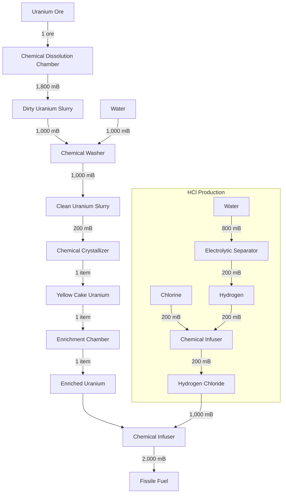
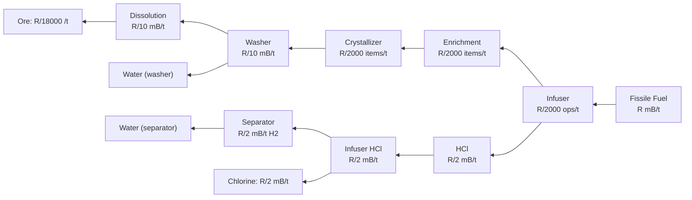
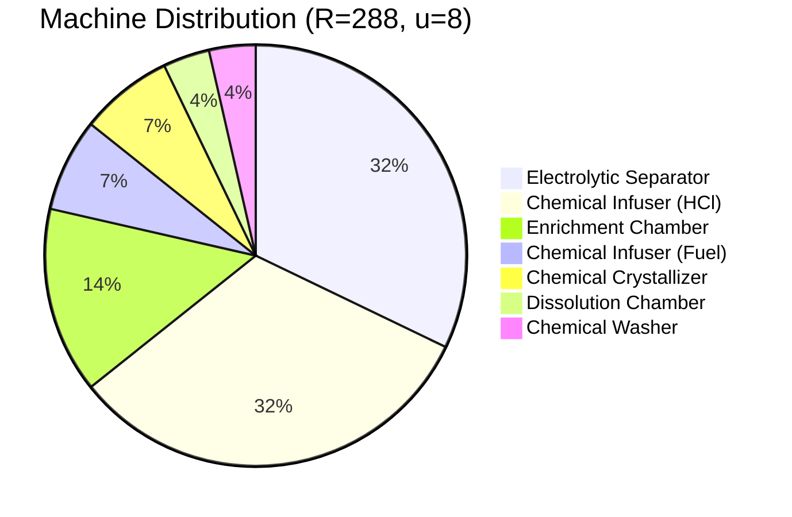

# Fissile Fuel Production Chain

## Processing Chain Overview

The full production chain from Uranium Ore to Fissile Fuel involves five main processing stages and two support stages for HCl synthesis:

## Variable Definitions

| Symbol | Meaning |
| ------ | ------- |
| $u$ | Number of speed upgrades installed (0--8) |
| $t_{\text{base}}$ | Base processing time of a machine (in ticks) |
| $t_{\text{eff}}$ | Effective processing time after speed upgrades (in ticks) |
| $R$ | Target Fissile Fuel output rate (mB/t) |
| $\lambda_i$ | Output rate of a single machine at stage $i$ (mB/t or items/t) |
| $N_i$ | Number of machines required at stage $i$ |
| $\varepsilon_i$ | Base energy per operation at stage $i$ (J) |
| $\mathcal{E}$ | Total energy consumption across all stages (J/t) |
| $\omega$ | Ore consumption rate (ore/t) |
| $\eta_w$ | Total water consumption rate (mB/t) |
| $\eta_{Cl}$ | Chlorine consumption rate (mB/t) |

## Constants Table

Machine specs from `PRODUCTION_CHAIN.*` in `constants.ts`:

| Stage | Machine | $t_{\text{base}}$ | Input | Output | $\varepsilon_i$ (J) |
| ----- | ------- | ------------------ | ----- | ------ | -------------------- |
| 1 | `Dissolution Chamber` | 100 | 1 Ore | 1{,}800 mB Dirty Slurry | 80{,}000 |
| 2 | `Chemical Washer` | 100 | 1{,}000 mB Dirty + Water | 1{,}000 mB Clean Slurry | 40{,}000 |
| 3 | `Chemical Crystallizer` | 100 | 200 mB Clean Slurry | 1 Yellow Cake | 40{,}000 |
| 4 | `Enrichment Chamber` | 200 | 1 Yellow Cake | 1 Enriched Uranium | 16{,}000 |
| 5 | `Chemical Infuser (Fuel)` | 100 | 1 Enriched + 1{,}000 mB HCl | 2{,}000 mB Fissile Fuel | 40{,}000 |
| A | `Electrolytic Separator` | 100 | 800 mB Water | 200 mB H$_2$ + 200 mB O$_2$ | 80{,}000 |
| B | `Chemical Infuser (HCl)` | 100 | 200 mB H$_2$ + 200 mB Cl | 200 mB HCl | 40{,}000 |

Maximum speed upgrades: $u_{\max} = 8$ (`PRODUCTION_CHAIN.MAX_SPEED_UPGRADES`).

## Speed Upgrade Formula

Each Mekanism machine can hold up to 8 speed upgrades. The effective processing time for a machine with $u$ speed upgrades ($0 \leq u \leq 8$) is:

$$t_{\text{eff}} = \left\lceil\dfrac{t_{\text{base}}}{1 + u}\right\rceil$$

For the two base tick values used in this chain:

| $u$ | $t_{\text{eff}}$ ($t_{\text{base}} = 100$) | $t_{\text{eff}}$ ($t_{\text{base}} = 200$) |
| --- | ------------------------------------------- | ------------------------------------------- |
| 0 | 100 | 200 |
| 1 | 50 | 100 |
| 2 | 34 | 67 |
| 3 | 25 | 50 |
| 4 | 20 | 40 |
| 5 | 17 | 34 |
| 6 | 15 | 29 |
| 7 | 13 | 25 |
| 8 | 12 | 23 |

## Throughput Calculations

### Per-Machine Output Rates

The output rate of a single machine at each stage is determined by dividing its output quantity per operation by $t_{\text{eff}}$:

$$\lambda_5 = \dfrac{2{,}000}{t_{\text{eff},5}} \text{ mB/t (Fissile Fuel)}$$

$$\lambda_4 = \dfrac{1}{t_{\text{eff},4}} \text{ items/t (Enriched Uranium)}$$

$$\lambda_3 = \dfrac{1}{t_{\text{eff},3}} \text{ items/t (Yellow Cake)}$$

$$\lambda_2 = \dfrac{1{,}000}{t_{\text{eff},2}} \text{ mB/t (Clean Slurry)}$$

$$\lambda_1 = \dfrac{1{,}800}{t_{\text{eff},1}} \text{ mB/t (Dirty Slurry)}$$

$$\lambda_A = \dfrac{200}{t_{\text{eff},A}} \text{ mB/t (H}_2\text{)}$$

$$\lambda_B = \dfrac{200}{t_{\text{eff},B}} \text{ mB/t (HCl)}$$

## Machine Count Formulas

We work backwards from a target Fissile Fuel production rate $R$ (mB/t).

### Stage 5 -- Chemical Infuser (Fuel)

Each operation produces 2{,}000 mB of Fissile Fuel and consumes 1 Enriched Uranium + 1{,}000 mB HCl.

$$N_5 = \left\lceil\dfrac{R}{\lambda_5}\right\rceil = \left\lceil\dfrac{R \cdot t_{\text{eff},5}}{2{,}000}\right\rceil$$

The required Enriched Uranium rate is:

$$\alpha = \dfrac{R}{2{,}000} \text{ items/t}$$

The required HCl rate is:

$$\eta_{\text{HCl}} = \dfrac{R \cdot 1{,}000}{2{,}000} = \dfrac{R}{2} \text{ mB/t}$$

### Stage 4 -- Enrichment Chamber

Each operation converts 1 Yellow Cake into 1 Enriched Uranium (1:1).

$$N_4 = \left\lceil\dfrac{\alpha}{\lambda_4}\right\rceil = \left\lceil\dfrac{\alpha \cdot t_{\text{eff},4}}{1}\right\rceil = \left\lceil\alpha \cdot t_{\text{eff},4}\right\rceil$$

### Stage 3 -- Chemical Crystallizer

Each operation converts 200 mB Clean Slurry into 1 Yellow Cake. The required Clean Slurry rate is:

$$\sigma = \alpha \cdot 200 \text{ mB/t}$$

$$N_3 = \left\lceil\dfrac{\alpha}{\lambda_3}\right\rceil = \left\lceil\alpha \cdot t_{\text{eff},3}\right\rceil$$

### Stage 2 -- Chemical Washer

Each operation converts 1{,}000 mB Dirty Slurry into 1{,}000 mB Clean Slurry (1:1 by volume), consuming 1{,}000 mB Water.

$$N_2 = \left\lceil\dfrac{\sigma}{\lambda_2}\right\rceil = \left\lceil\dfrac{\sigma \cdot t_{\text{eff},2}}{1{,}000}\right\rceil$$

### Stage 1 -- Chemical Dissolution Chamber

Each operation converts 1 Uranium Ore into 1{,}800 mB Dirty Slurry. The required Dirty Slurry rate equals the Clean Slurry rate $\sigma$ (since the washer converts 1:1).

$$N_1 = \left\lceil\dfrac{\sigma}{\lambda_1}\right\rceil = \left\lceil\dfrac{\sigma \cdot t_{\text{eff},1}}{1{,}800}\right\rceil$$

### Support B -- Chemical Infuser (HCl)

Each operation produces 200 mB HCl from 200 mB H$_2$ + 200 mB Cl. The required H$_2$ (and Cl) rate is:

$$\eta_{H_2} = \eta_{Cl} = \eta_{\text{HCl}}$$

$$N_B = \left\lceil\dfrac{\eta_{\text{HCl}}}{\lambda_B}\right\rceil = \left\lceil\dfrac{\eta_{\text{HCl}} \cdot t_{\text{eff},B}}{200}\right\rceil$$

### Support A -- Electrolytic Separator

Each operation produces 200 mB H$_2$ (and 200 mB O$_2$) from 800 mB Water.

$$N_A = \left\lceil\dfrac{\eta_{H_2}}{\lambda_A}\right\rceil = \left\lceil\dfrac{\eta_{H_2} \cdot t_{\text{eff},A}}{200}\right\rceil$$

## Resource Input Rates

### Ore Consumption

$$\omega = \dfrac{\sigma}{1{,}800} = \dfrac{\alpha \cdot 200}{1{,}800} = \dfrac{R}{18{,}000} \text{ ore/t}$$

### Water Consumption

Water is consumed by the `Chemical Washer` (Stage 2) and the `Electrolytic Separator` (Support A):

$$\eta_w = \underbrace{\sigma}_{\text{Washer}} + \underbrace{\eta_{H_2} \cdot \dfrac{800}{200}}_{\text{Separator}} = \alpha \cdot 200 + \eta_{\text{HCl}} \cdot 4$$

$$\eta_w = \dfrac{R \cdot 200}{2{,}000} + \dfrac{R}{2} \cdot 4 = \dfrac{R}{10} + 2R = \dfrac{21R}{10} \text{ mB/t}$$

### Chlorine Consumption

$$\eta_{Cl} = \eta_{\text{HCl}} = \dfrac{R}{2} \text{ mB/t}$$

### Total Energy Consumption

The energy per tick for a single machine at stage $i$ is $\varepsilon_i / t_{\text{eff},i}$. Summing over all machines:

$$\mathcal{E} = \sum_{i} N_i \cdot \dfrac{\varepsilon_i}{t_{\text{eff},i}} \text{ J/t}$$

Expanded:

$$\mathcal{E} = N_1 \cdot \dfrac{80{,}000}{t_{\text{eff},1}} + N_2 \cdot \dfrac{40{,}000}{t_{\text{eff},2}} + N_3 \cdot \dfrac{40{,}000}{t_{\text{eff},3}} + N_4 \cdot \dfrac{16{,}000}{t_{\text{eff},4}} + N_5 \cdot \dfrac{40{,}000}{t_{\text{eff},5}} + N_A \cdot \dfrac{80{,}000}{t_{\text{eff},A}} + N_B \cdot \dfrac{40{,}000}{t_{\text{eff},B}}$$

## Worked Example

Consider a default $10 \times 10 \times 12$ `Fission Reactor` with a burn rate of $R = 288$ mB/t and all machines equipped with $u = 8$ speed upgrades.

### Effective Processing Times

From the speed upgrade formula with $u = 8$:

$$t_{\text{eff}} = \left\lceil\dfrac{t_{\text{base}}}{1 + 8}\right\rceil = \left\lceil\dfrac{t_{\text{base}}}{9}\right\rceil$$

- Stages 1, 2, 3, 5, A, B ($t_{\text{base}} = 100$): $t_{\text{eff}} = \left\lceil\dfrac{100}{9}\right\rceil = 12$ ticks
- Stage 4 ($t_{\text{base}} = 200$): $t_{\text{eff}} = \left\lceil\dfrac{200}{9}\right\rceil = 23$ ticks

### Intermediate Rates

Working backwards from $R = 288$ mB/t:

$$\alpha = \dfrac{288}{2{,}000} = 0.144 \text{ items/t (Enriched Uranium)}$$

$$\sigma = 0.144 \times 200 = 28.8 \text{ mB/t (Clean/Dirty Slurry)}$$

$$\eta_{\text{HCl}} = \dfrac{288}{2} = 144 \text{ mB/t}$$

$$\eta_{H_2} = \eta_{Cl} = 144 \text{ mB/t}$$

### Per-Machine Output Rates

$$\lambda_5 = \dfrac{2{,}000}{12} \approx 166.67 \text{ mB/t}$$

$$\lambda_4 = \dfrac{1}{23} \approx 0.0435 \text{ items/t}$$

$$\lambda_3 = \dfrac{1}{12} \approx 0.0833 \text{ items/t}$$

$$\lambda_2 = \dfrac{1{,}000}{12} \approx 83.33 \text{ mB/t}$$

$$\lambda_1 = \dfrac{1{,}800}{12} = 150 \text{ mB/t}$$

$$\lambda_A = \dfrac{200}{12} \approx 16.67 \text{ mB/t}$$

$$\lambda_B = \dfrac{200}{12} \approx 16.67 \text{ mB/t}$$

### Machine Counts

$$N_5 = \left\lceil\dfrac{288}{166.67}\right\rceil = \left\lceil 1.728 \right\rceil = 2$$

$$N_4 = \left\lceil 0.144 \times 23 \right\rceil = \left\lceil 3.312 \right\rceil = 4$$

$$N_3 = \left\lceil 0.144 \times 12 \right\rceil = \left\lceil 1.728 \right\rceil = 2$$

$$N_2 = \left\lceil\dfrac{28.8 \times 12}{1{,}000}\right\rceil = \left\lceil 0.346 \right\rceil = 1$$

$$N_1 = \left\lceil\dfrac{28.8 \times 12}{1{,}800}\right\rceil = \left\lceil 0.192 \right\rceil = 1$$

$$N_B = \left\lceil\dfrac{144 \times 12}{200}\right\rceil = \left\lceil 8.64 \right\rceil = 9$$

$$N_A = \left\lceil\dfrac{144 \times 12}{200}\right\rceil = \left\lceil 8.64 \right\rceil = 9$$

### Resource Rates

**Ore consumption:**

$$\omega = \dfrac{288}{18{,}000} = 0.016 \text{ ore/t} = 0.32 \text{ ore/s}$$

**Water consumption:**

$$\eta_w = \dfrac{21 \times 288}{10} = 604.8 \text{ mB/t}$$

Broken down:

- Washer: $28.8$ mB/t
- Separators: $144 \times 4 = 576$ mB/t

**Chlorine consumption:**

$$\eta_{Cl} = 144 \text{ mB/t}$$

### Energy Consumption

$$\mathcal{E} = 1 \cdot \dfrac{80{,}000}{12} + 1 \cdot \dfrac{40{,}000}{12} + 2 \cdot \dfrac{40{,}000}{12} + 4 \cdot \dfrac{16{,}000}{23} + 2 \cdot \dfrac{40{,}000}{12} + 9 \cdot \dfrac{80{,}000}{12} + 9 \cdot \dfrac{40{,}000}{12}$$

$$\downarrow$$

$$\mathcal{E} = 6{,}666.67 + 3{,}333.33 + 6{,}666.67 + 2{,}782.61 + 6{,}666.67 + 60{,}000 + 30{,}000$$

$$\downarrow$$

$$\mathcal{E} \approx 116{,}115.94 \text{ J/t} \approx 116.12 \text{ kJ/t} \approx 46.45 \text{ kFE/t}$$

### Summary

| Stage | Machine | Count | Rate |
| ----- | ------- | ----- | ---- |
| 1 | `Dissolution Chamber` | 1 | 150 mB/t (slurry) |
| 2 | `Chemical Washer` | 1 | 83.33 mB/t (clean slurry) |
| 3 | `Chemical Crystallizer` | 2 | 0.0833 items/t each |
| 4 | `Enrichment Chamber` | 4 | 0.0435 items/t each |
| 5 | `Chemical Infuser (Fuel)` | 2 | 166.67 mB/t each |
| A | `Electrolytic Separator` | 9 | 16.67 mB/t H$_2$ each |
| B | `Chemical Infuser (HCl)` | 9 | 16.67 mB/t HCl each |
| **Total** | | **28** | **288 mB/t Fissile Fuel** |

| Resource | Rate |
| -------- | ---- |
| Uranium Ore | 0.016 ore/t (0.32 ore/s) |
| Water | 604.8 mB/t |
| Chlorine | 144 mB/t |
| Energy | ~116.12 kJ/t |

> **Note:** The HCl support chain (Stages A and B) dominates the machine count and energy budget. The 9 Electrolytic Separators alone account for over half the total energy draw.

## Modpack Notice

> **Note:** Modpacks may modify machine recipes, processing rates, energy costs, or the production chain itself. The formulas and constants above reflect the default Mekanism configuration. Always verify `PRODUCTION_CHAIN.*` values in `constants.ts` or the in-game JEI/REI tooltips when playing a modpack.
