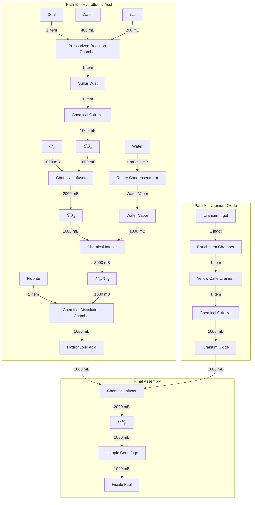
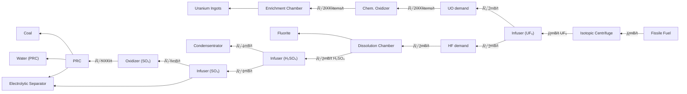
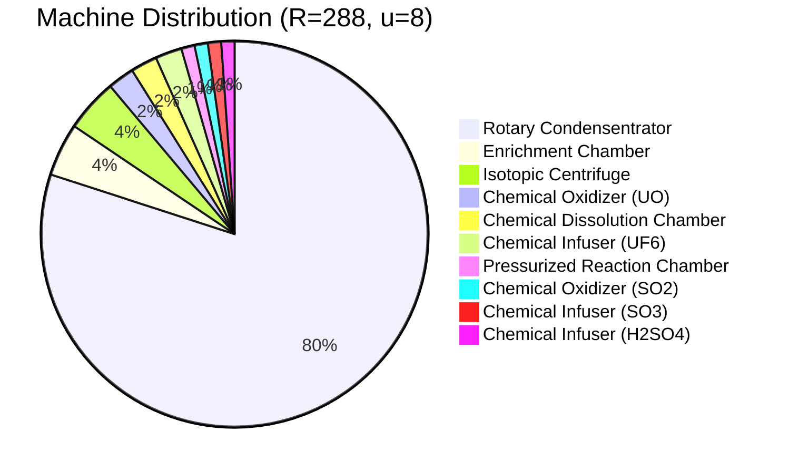

# Fissile Fuel Production Chain

## Processing Chain Overview

The Fissile Fuel production chain splits into two parallel paths that converge in a final assembly stage. **Path A** produces Uranium Oxide from Uranium Ingots. **Path B** synthesises Hydrofluoric Acid through a multi-step sulfuric acid sub-chain plus Fluorite. The two intermediates (UO and HF) combine into Uranium Hexafluoride, which is centrifuged into Fissile Fuel.

## Variable Definitions

| Symbol | Meaning |
| ------ | ------- |
| $u$ | Number of speed upgrades installed ($0 \leq u \leq 8$) |
| $t_{\text{base}}$ | Base processing time of a machine (in ticks) |
| $t_{\text{eff}}$ | Effective processing time after speed upgrades (in ticks) |
| $R$ | Target Fissile Fuel output rate (mB/t) |
| $\lambda_i$ | Output rate of a single machine at stage $i$ (mB/t or items/t) |
| $N_i$ | Number of machines required at stage $i$ |
| $\varepsilon_i$ | Base energy per operation at stage $i$ (J) |
| $\mathcal{E}$ | Total energy consumption across all stages (J/t) |
| $\omega_U$ | Uranium Ingot consumption rate (items/t) |
| $\omega_F$ | Fluorite consumption rate (items/t) |
| $\omega_C$ | Coal consumption rate (items/t) |
| $\eta_w$ | Total water consumption rate (mB/t) |
| $\eta_{O_2}$ | Total oxygen consumption rate (mB/t) |

## Constants Table

Machine specs from `PRODUCTION_CHAIN.*` in `constants.ts`:

| # | Stage | Machine | $t_{\text{base}}$ | Input | Output | $\varepsilon_i$ (J) |
| - | ----- | ------- | ------------------ | ----- | ------ | -------------------- |
| A1 | Path A | `Enrichment Chamber` | 200 | 1 Uranium Ingot | 1 Yellow Cake | 16{,}000 |
| A2 | Path A | `Chemical Oxidizer` | 100 | 1 Yellow Cake | 1{,}000 mB UO | 40{,}000 |
| B1 | Path B | `Pressurized Reaction Chamber` | 200 | 1 Coal + 400 mB Water + 200 mB O$_2$ | 1 Sulfur Dust | 20{,}000 |
| B2 | Path B | `Chemical Oxidizer` | 100 | 1 Sulfur Dust | 1{,}000 mB SO$_2$ | 40{,}000 |
| B3 | Path B | `Chemical Infuser (SO$_3$)` | 100 | 1{,}000 mB SO$_2$ + 1{,}000 mB O$_2$ | 2{,}000 mB SO$_3$ | 40{,}000 |
| B4 | Path B | `Rotary Condensentrator` | 1 | 1 mB Water | 1 mB Water Vapor | 400 |
| B5 | Path B | `Chemical Infuser (H$_2$SO$_4$)` | 100 | 1{,}000 mB SO$_3$ + 1{,}000 mB Vapor | 2{,}000 mB H$_2$SO$_4$ | 40{,}000 |
| B6 | Path B | `Chemical Dissolution Chamber` | 100 | 1 Fluorite + 1{,}000 mB H$_2$SO$_4$ | 1{,}000 mB HF | 80{,}000 |
| F1 | Final | `Chemical Infuser (UF$_6$)` | 100 | 1{,}000 mB HF + 1{,}000 mB UO | 2{,}000 mB UF$_6$ | 40{,}000 |
| F2 | Final | `Isotopic Centrifuge` | 100 | 1{,}000 mB UF$_6$ | 1{,}000 mB Fissile Fuel | 40{,}000 |

Maximum speed upgrades: $u_{\max} = 8$ (`PRODUCTION_CHAIN.MAX_SPEED_UPGRADES`).

## Speed Upgrade Formula

Each Mekanism machine can hold up to 8 speed upgrades. The effective processing time for a machine with $u$ speed upgrades ($0 \leq u \leq 8$) is:

$$t_{\text{eff}} = \left\lceil\dfrac{t_{\text{base}}}{1 + u}\right\rceil$$

For the three distinct base tick values used in this chain:

| $u$ | $t_{\text{eff}}$ ($t_{\text{base}} = 200$) | $t_{\text{eff}}$ ($t_{\text{base}} = 100$) | $t_{\text{eff}}$ ($t_{\text{base}} = 1$) |
| --- | ------------------------------------------- | ------------------------------------------- | ----------------------------------------- |
| 0 | 200 | 100 | 1 |
| 1 | 100 | 50 | 1 |
| 2 | 67 | 34 | 1 |
| 3 | 50 | 25 | 1 |
| 4 | 40 | 20 | 1 |
| 5 | 34 | 17 | 1 |
| 6 | 29 | 15 | 1 |
| 7 | 25 | 13 | 1 |
| 8 | 23 | 12 | 1 |

Note that the `Rotary Condensentrator` has $t_{\text{base}} = 1$, so $t_{\text{eff}} = 1$ regardless of speed upgrades.

## Throughput Calculations

### Per-Machine Output Rates

The output rate of a single machine at each stage is determined by dividing its output quantity per operation by $t_{\text{eff}}$:

**Final Assembly:**

$$\lambda_{F2} = \dfrac{1{,}000}{t_{\text{eff},F2}} \text{ mB/t (Fissile Fuel)}$$

$$\lambda_{F1} = \dfrac{2{,}000}{t_{\text{eff},F1}} \text{ mB/t (UF}_6\text{)}$$

**Path A:**

$$\lambda_{A1} = \dfrac{1}{t_{\text{eff},A1}} \text{ items/t (Yellow Cake)}$$

$$\lambda_{A2} = \dfrac{1{,}000}{t_{\text{eff},A2}} \text{ mB/t (UO)}$$

**Path B:**

$$\lambda_{B1} = \dfrac{1}{t_{\text{eff},B1}} \text{ items/t (Sulfur Dust)}$$

$$\lambda_{B2} = \dfrac{1{,}000}{t_{\text{eff},B2}} \text{ mB/t (SO}_2\text{)}$$

$$\lambda_{B3} = \dfrac{2{,}000}{t_{\text{eff},B3}} \text{ mB/t (SO}_3\text{)}$$

$$\lambda_{B4} = \dfrac{1}{t_{\text{eff},B4}} \text{ mB/t (Water Vapor)}$$

$$\lambda_{B5} = \dfrac{2{,}000}{t_{\text{eff},B5}} \text{ mB/t (H}_2\text{SO}_4\text{)}$$

$$\lambda_{B6} = \dfrac{1{,}000}{t_{\text{eff},B6}} \text{ mB/t (HF)}$$

## Machine Count Formulas

We work backwards from a target Fissile Fuel production rate $R$ (mB/t). At each stage we compute the demand rate flowing into that machine and divide by its single-machine output to obtain the machine count (rounded up).

### Stage F2 -- Isotopic Centrifuge

Each operation converts 1{,}000 mB UF$_6$ into 1{,}000 mB Fissile Fuel.

$$N_{F2} = \left\lceil\dfrac{R}{\lambda_{F2}}\right\rceil = \left\lceil\dfrac{R \cdot t_{\text{eff},F2}}{1{,}000}\right\rceil$$

The required UF$_6$ rate is:

$$D_{UF_6} = R \text{ mB/t}$$

### Stage F1 -- Chemical Infuser (UF$_6$)

Each operation combines 1{,}000 mB HF + 1{,}000 mB UO into 2{,}000 mB UF$_6$.

$$N_{F1} = \left\lceil\dfrac{D_{UF_6}}{\lambda_{F1}}\right\rceil = \left\lceil\dfrac{R \cdot t_{\text{eff},F1}}{2{,}000}\right\rceil$$

The required HF and UO rates are each:

$$D_{HF} = D_{UO} = \dfrac{R}{2} \text{ mB/t}$$

### Path A -- Uranium Oxide

**Stage A2 -- Chemical Oxidizer (UO):**
Each operation converts 1 Yellow Cake into 1{,}000 mB UO.

$$N_{A2} = \left\lceil\dfrac{D_{UO}}{\lambda_{A2}}\right\rceil = \left\lceil\dfrac{D_{UO} \cdot t_{\text{eff},A2}}{1{,}000}\right\rceil$$

The required Yellow Cake rate is:

$$D_{YC} = \dfrac{D_{UO}}{1{,}000} = \dfrac{R}{2{,}000} \text{ items/t}$$

**Stage A1 -- Enrichment Chamber:**
Each operation converts 1 Uranium Ingot into 1 Yellow Cake.

$$N_{A1} = \left\lceil\dfrac{D_{YC}}{\lambda_{A1}}\right\rceil = \left\lceil D_{YC} \cdot t_{\text{eff},A1} \right\rceil$$

### Path B -- Hydrofluoric Acid

**Stage B6 -- Chemical Dissolution Chamber:**
Each operation converts 1 Fluorite + 1{,}000 mB H$_2$SO$_4$ into 1{,}000 mB HF.

$$N_{B6} = \left\lceil\dfrac{D_{HF}}{\lambda_{B6}}\right\rceil = \left\lceil\dfrac{D_{HF} \cdot t_{\text{eff},B6}}{1{,}000}\right\rceil$$

The required H$_2$SO$_4$ rate is:

$$D_{H_2SO_4} = D_{HF} = \dfrac{R}{2} \text{ mB/t}$$

**Stage B5 -- Chemical Infuser (H$_2$SO$_4$):**
Each operation combines 1{,}000 mB SO$_3$ + 1{,}000 mB Water Vapor into 2{,}000 mB H$_2$SO$_4$.

$$N_{B5} = \left\lceil\dfrac{D_{H_2SO_4}}{\lambda_{B5}}\right\rceil = \left\lceil\dfrac{D_{H_2SO_4} \cdot t_{\text{eff},B5}}{2{,}000}\right\rceil$$

The required SO$_3$ and Water Vapor rates are each:

$$D_{SO_3} = D_{\text{Vapor}} = \dfrac{D_{H_2SO_4}}{2} = \dfrac{R}{4} \text{ mB/t}$$

**Stage B4 -- Rotary Condensentrator:**
Converts Water to Water Vapor at 1 mB : 1 mB, 1 tick per operation. This machine is effectively a passthrough at 1 mB/t per machine.

$$N_{B4} = \left\lceil\dfrac{D_{\text{Vapor}}}{\lambda_{B4}}\right\rceil = \left\lceil D_{\text{Vapor}} \right\rceil = \left\lceil\dfrac{R}{4}\right\rceil$$

> Note: In practice the Rotary Condensentrator processes fluid continuously at high throughput, so a small number of machines suffices. The formula above gives the theoretical count; consult in-game pipe bandwidth.

**Stage B3 -- Chemical Infuser (SO$_3$):**
Each operation combines 1{,}000 mB SO$_2$ + 1{,}000 mB O$_2$ into 2{,}000 mB SO$_3$.

$$N_{B3} = \left\lceil\dfrac{D_{SO_3}}{\lambda_{B3}}\right\rceil = \left\lceil\dfrac{D_{SO_3} \cdot t_{\text{eff},B3}}{2{,}000}\right\rceil$$

The required SO$_2$ and O$_2$ (for this stage) rates are each:

$$D_{SO_2} = D_{O_2}^{(B3)} = \dfrac{D_{SO_3}}{2} = \dfrac{R}{8} \text{ mB/t}$$

**Stage B2 -- Chemical Oxidizer (SO$_2$):**
Each operation converts 1 Sulfur Dust into 1{,}000 mB SO$_2$.

$$N_{B2} = \left\lceil\dfrac{D_{SO_2}}{\lambda_{B2}}\right\rceil = \left\lceil\dfrac{D_{SO_2} \cdot t_{\text{eff},B2}}{1{,}000}\right\rceil$$

The required Sulfur Dust rate is:

$$D_{\text{Sulfur}} = \dfrac{D_{SO_2}}{1{,}000} = \dfrac{R}{8{,}000} \text{ items/t}$$

**Stage B1 -- Pressurized Reaction Chamber:**
Each operation consumes 1 Coal + 400 mB Water + 200 mB O$_2$ and produces 1 Sulfur Dust.

$$N_{B1} = \left\lceil\dfrac{D_{\text{Sulfur}}}{\lambda_{B1}}\right\rceil = \left\lceil D_{\text{Sulfur}} \cdot t_{\text{eff},B1} \right\rceil$$

## Resource Input Rates

### Uranium Ingot Consumption

$$\omega_U = D_{YC} = \dfrac{R}{2{,}000} \text{ items/t}$$

### Fluorite Consumption

$$\omega_F = \dfrac{D_{HF}}{1{,}000} = \dfrac{R}{2{,}000} \text{ items/t}$$

### Coal Consumption

$$\omega_C = D_{\text{Sulfur}} = \dfrac{R}{8{,}000} \text{ items/t}$$

### Water Consumption

Water is consumed by the `Pressurized Reaction Chamber` (B1) and the `Rotary Condensentrator` (B4):

$$\eta_w = \underbrace{D_{\text{Sulfur}} \cdot 400}_{\text{PRC}} + \underbrace{D_{\text{Vapor}}}_{\text{Condensentrator}} = \dfrac{R \cdot 400}{8{,}000} + \dfrac{R}{4} = \dfrac{R}{20} + \dfrac{R}{4} = \dfrac{3R}{10} \text{ mB/t}$$

### Oxygen Consumption

Oxygen is consumed by the `Pressurized Reaction Chamber` (B1, 200 mB per op) and the `Chemical Infuser SO$_3$` (B3, 1{,}000 mB per op):

$$\eta_{O_2} = \underbrace{D_{\text{Sulfur}} \cdot 200}_{\text{PRC}} + \underbrace{D_{O_2}^{(B3)}}_{\text{SO}_3\text{ Infuser}} = \dfrac{R \cdot 200}{8{,}000} + \dfrac{R}{8} = \dfrac{R}{40} + \dfrac{R}{8} = \dfrac{R}{8} + \dfrac{R}{40} = \dfrac{3R}{20} \text{ mB/t}$$

### Total Energy Consumption

The energy per tick for a single machine at stage $i$ is $\varepsilon_i / t_{\text{eff},i}$. Summing over all machines:

$$\mathcal{E} = \sum_{i} N_i \cdot \dfrac{\varepsilon_i}{t_{\text{eff},i}} \text{ J/t}$$

Expanded:

$$\mathcal{E} = N_{A1} \cdot \dfrac{16{,}000}{t_{\text{eff},A1}} + N_{A2} \cdot \dfrac{40{,}000}{t_{\text{eff},A2}} + N_{B1} \cdot \dfrac{20{,}000}{t_{\text{eff},B1}} + N_{B2} \cdot \dfrac{40{,}000}{t_{\text{eff},B2}} + N_{B3} \cdot \dfrac{40{,}000}{t_{\text{eff},B3}}$$

$$+ N_{B4} \cdot \dfrac{400}{t_{\text{eff},B4}} + N_{B5} \cdot \dfrac{40{,}000}{t_{\text{eff},B5}} + N_{B6} \cdot \dfrac{80{,}000}{t_{\text{eff},B6}} + N_{F1} \cdot \dfrac{40{,}000}{t_{\text{eff},F1}} + N_{F2} \cdot \dfrac{40{,}000}{t_{\text{eff},F2}}$$

## Worked Example

Consider a default $10 \times 10 \times 12$ `Fission Reactor` with a burn rate of $R = 288$ mB/t and all machines equipped with $u = 8$ speed upgrades.

### Effective Processing Times

From the speed upgrade formula with $u = 8$:

$$t_{\text{eff}} = \left\lceil\dfrac{t_{\text{base}}}{1 + 8}\right\rceil = \left\lceil\dfrac{t_{\text{base}}}{9}\right\rceil$$

- Stages with $t_{\text{base}} = 100$ (A2, B2, B3, B5, B6, F1, F2): $t_{\text{eff}} = \left\lceil\dfrac{100}{9}\right\rceil = 12$ ticks
- Stages with $t_{\text{base}} = 200$ (A1, B1): $t_{\text{eff}} = \left\lceil\dfrac{200}{9}\right\rceil = 23$ ticks
- Stage B4 ($t_{\text{base}} = 1$): $t_{\text{eff}} = 1$ tick

### Intermediate Demand Rates

Working backwards from $R = 288$ mB/t:

$$D_{UF_6} = R = 288 \text{ mB/t}$$

$$D_{HF} = D_{UO} = \dfrac{288}{2} = 144 \text{ mB/t}$$

$$D_{YC} = \dfrac{144}{1{,}000} = 0.144 \text{ items/t}$$

$$D_{H_2SO_4} = 144 \text{ mB/t}$$

$$D_{SO_3} = D_{\text{Vapor}} = \dfrac{144}{2} = 72 \text{ mB/t}$$

$$D_{SO_2} = D_{O_2}^{(B3)} = \dfrac{72}{2} = 36 \text{ mB/t}$$

$$D_{\text{Sulfur}} = \dfrac{36}{1{,}000} = 0.036 \text{ items/t}$$

### Per-Machine Output Rates

$$\lambda_{F2} = \dfrac{1{,}000}{12} \approx 83.33 \text{ mB/t}$$

$$\lambda_{F1} = \dfrac{2{,}000}{12} \approx 166.67 \text{ mB/t}$$

$$\lambda_{A2} = \dfrac{1{,}000}{12} \approx 83.33 \text{ mB/t}$$

$$\lambda_{A1} = \dfrac{1}{23} \approx 0.0435 \text{ items/t}$$

$$\lambda_{B6} = \dfrac{1{,}000}{12} \approx 83.33 \text{ mB/t}$$

$$\lambda_{B5} = \dfrac{2{,}000}{12} \approx 166.67 \text{ mB/t}$$

$$\lambda_{B4} = 1 \text{ mB/t}$$

$$\lambda_{B3} = \dfrac{2{,}000}{12} \approx 166.67 \text{ mB/t}$$

$$\lambda_{B2} = \dfrac{1{,}000}{12} \approx 83.33 \text{ mB/t}$$

$$\lambda_{B1} = \dfrac{1}{23} \approx 0.0435 \text{ items/t}$$

### Machine Counts

**Final Assembly:**

$$N_{F2} = \left\lceil\dfrac{288}{83.33}\right\rceil = \left\lceil 3.456 \right\rceil = 4$$

$$N_{F1} = \left\lceil\dfrac{288}{166.67}\right\rceil = \left\lceil 1.728 \right\rceil = 2$$

**Path A:**

$$N_{A2} = \left\lceil\dfrac{144}{83.33}\right\rceil = \left\lceil 1.728 \right\rceil = 2$$

$$N_{A1} = \left\lceil 0.144 \times 23 \right\rceil = \left\lceil 3.312 \right\rceil = 4$$

**Path B:**

$$N_{B6} = \left\lceil\dfrac{144}{83.33}\right\rceil = \left\lceil 1.728 \right\rceil = 2$$

$$N_{B5} = \left\lceil\dfrac{144}{166.67}\right\rceil = \left\lceil 0.864 \right\rceil = 1$$

$$N_{B4} = \left\lceil\dfrac{72}{1}\right\rceil = 72$$

$$N_{B3} = \left\lceil\dfrac{72}{166.67}\right\rceil = \left\lceil 0.432 \right\rceil = 1$$

$$N_{B2} = \left\lceil\dfrac{36}{83.33}\right\rceil = \left\lceil 0.432 \right\rceil = 1$$

$$N_{B1} = \left\lceil 0.036 \times 23 \right\rceil = \left\lceil 0.828 \right\rceil = 1$$

### Resource Rates

**Uranium Ingot consumption:**

$$\omega_U = \dfrac{288}{2{,}000} = 0.144 \text{ items/t} = 2.88 \text{ items/s}$$

**Fluorite consumption:**

$$\omega_F = \dfrac{288}{2{,}000} = 0.144 \text{ items/t} = 2.88 \text{ items/s}$$

**Coal consumption:**

$$\omega_C = \dfrac{288}{8{,}000} = 0.036 \text{ items/t} = 0.72 \text{ items/s}$$

**Water consumption:**

$$\eta_w = \dfrac{3 \times 288}{10} = 86.4 \text{ mB/t}$$

Broken down:

- PRC: $0.036 \times 400 = 14.4$ mB/t
- Condensentrator: $72$ mB/t

**Oxygen consumption:**

$$\eta_{O_2} = \dfrac{3 \times 288}{20} = 43.2 \text{ mB/t}$$

Broken down:

- PRC: $0.036 \times 200 = 7.2$ mB/t
- SO$_3$ Infuser: $36$ mB/t

### Energy Consumption

$$\mathcal{E} = 4 \cdot \dfrac{16{,}000}{23} + 2 \cdot \dfrac{40{,}000}{12} + 1 \cdot \dfrac{20{,}000}{23} + 1 \cdot \dfrac{40{,}000}{12} + 1 \cdot \dfrac{40{,}000}{12}$$

$$+ 72 \cdot \dfrac{400}{1} + 1 \cdot \dfrac{40{,}000}{12} + 2 \cdot \dfrac{80{,}000}{12} + 2 \cdot \dfrac{40{,}000}{12} + 4 \cdot \dfrac{40{,}000}{12}$$

$$\downarrow$$

$$\mathcal{E} = 2{,}782.61 + 6{,}666.67 + 869.57 + 3{,}333.33 + 3{,}333.33$$

$$+ 28{,}800 + 3{,}333.33 + 13{,}333.33 + 6{,}666.67 + 13{,}333.33$$

$$\downarrow$$

$$\mathcal{E} \approx 82{,}452.17 \text{ J/t} \approx 82.45 \text{ kJ/t} \approx 32.98 \text{ kFE/t}$$

### Summary

| Stage | Machine | Count | Rate |
| ----- | ------- | ----- | ---- |
| A1 | `Enrichment Chamber` | 4 | 0.0435 items/t each |
| A2 | `Chemical Oxidizer (UO)` | 2 | 83.33 mB/t each |
| B1 | `Pressurized Reaction Chamber` | 1 | 0.0435 items/t |
| B2 | `Chemical Oxidizer (SO$_2$)` | 1 | 83.33 mB/t |
| B3 | `Chemical Infuser (SO$_3$)` | 1 | 166.67 mB/t |
| B4 | `Rotary Condensentrator` | 72 | 1 mB/t each |
| B5 | `Chemical Infuser (H$_2$SO$_4$)` | 1 | 166.67 mB/t |
| B6 | `Chemical Dissolution Chamber` | 2 | 83.33 mB/t each |
| F1 | `Chemical Infuser (UF$_6$)` | 2 | 166.67 mB/t each |
| F2 | `Isotopic Centrifuge` | 4 | 83.33 mB/t each |
| **Total** | | **90** | **288 mB/t Fissile Fuel** |

| Resource | Rate |
| -------- | ---- |
| Uranium Ingots | 0.144 items/t (2.88 items/s) |
| Fluorite | 0.144 items/t (2.88 items/s) |
| Coal | 0.036 items/t (0.72 items/s) |
| Water | 86.4 mB/t |
| Oxygen (O$_2$) | 43.2 mB/t |
| Energy | ~82.45 kJ/t (~32.98 kFE/t) |

> **Note:** The Rotary Condensentrator dominates the machine count at 72 units (80% of the total). In practice, the Condensentrator's effective throughput is often much higher than the 1 mB/t theoretical minimum used here -- the machine processes continuously when supplied with fluid, so far fewer physical machines may be needed. Always verify actual throughput in-game.

## Modpack Notice

> **Note:** Modpacks may modify machine recipes, processing rates, energy costs, or the production chain itself. The formulas and constants above reflect the default Mekanism configuration. Always verify `PRODUCTION_CHAIN.*` values in `constants.ts` or the in-game JEI/REI tooltips when playing a modpack.
