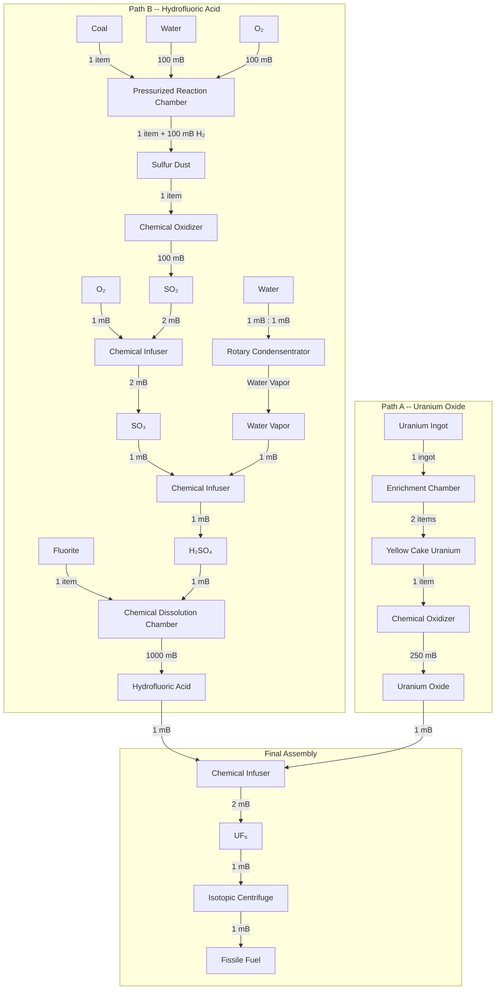
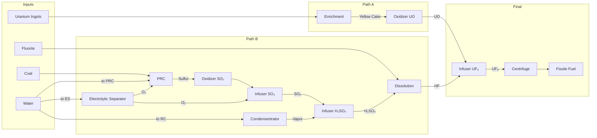
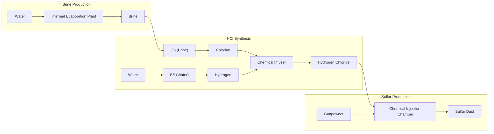
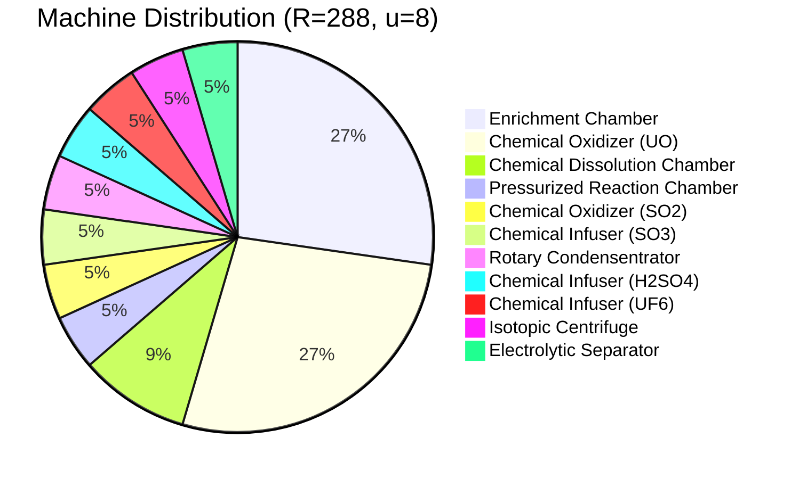

# Fissile Fuel Production Chain

## Processing Chain Overview

The Fissile Fuel production chain splits into two parallel paths that converge in a final assembly stage. **Path A** produces Uranium Oxide from Uranium Ingots. **Path B** synthesises Hydrofluoric Acid through a multi-step sulfuric acid sub-chain plus Fluorite. The two intermediates (UO and HF) combine into Uranium Hexafluoride, which is centrifuged into Fissile Fuel.

## Variable Definitions

| Symbol | Meaning |
| ------ | ------- |
| $u$ | Number of speed upgrades installed ($0 \leq u \leq 8$) |
| $t_{\text{base}}$ | Base processing time of a machine (in ticks) |
| $t_{\text{eff}}$ | Effective processing time after speed upgrades (in ticks) |
| $R$ | Target Fissile Fuel output rate (mB/t) |
| $\lambda_i$ | Output rate of a single machine at stage $i$ (mB/t or items/t) |
| $N_i$ | Number of machines required at stage $i$ |
| $\varepsilon_i$ | Base energy per operation at stage $i$ (J) |
| $\mathcal{E}$ | Total energy consumption across all stages (J/t) |
| $\omega_U$ | Uranium Ingot consumption rate (items/t) |
| $\omega_F$ | Fluorite consumption rate (items/t) |
| $\omega_C$ | Coal consumption rate (items/t) |
| $\eta_w$ | Total water consumption rate (mB/t) |
| $\eta_{O_2}$ | Total oxygen consumption rate (mB/t) |

## Constants Table

Machine specs from `PRODUCTION_CHAIN.*` in `constants.ts`:

### Batch Machines

These machines process discrete operations with a base tick duration. Speed upgrades reduce the ticks per operation.

| # | Stage | Machine | $t_{\text{base}}$ | Input | Output | $\varepsilon_i$ (J) |
| - | ----- | ------- | ------------------ | ----- | ------ | -------------------- |
| A1 | Path A | `Enrichment Chamber` | 200 | 1 Uranium Ingot | 2 Yellow Cake | 16{,}000 |
| A2 | Path A | `Chemical Oxidizer (UO)` | 100 | 1 Yellow Cake | 250 mB UO | 40{,}000 |
| B1 | Path B | `Pressurized Reaction Chamber` | 100 | 1 Coal + 100 mB Water + 100 mB O₂ | 1 Sulfur Dust + 100 mB H₂ | 20{,}000 |
| B2 | Path B | `Chemical Oxidizer (SO₂)` | 100 | 1 Sulfur Dust | 100 mB SO₂ | 40{,}000 |
| B6 | Path B | `Chemical Dissolution Chamber` | 100 | 1 Fluorite + 1 mB H₂SO₄ | 1{,}000 mB HF | 80{,}000 |

### Flow-Rate Machines

These machines operate on a **per-mB ratio** basis — they do not have a ticks-per-operation cycle like batch machines. Instead, they continuously convert input to output at whatever rate the piping can supply. For modelling purposes, **1 machine of each type is sufficient** to handle any throughput, limited only by pipe bandwidth.

| # | Stage | Machine | Per-mB Ratio | $\varepsilon_i$ (J) |
| - | ----- | ------- | ------------ | -------------------- |
| B3 | Path B | `Chemical Infuser (SO₃)` | 2 mB SO₂ + 1 mB O₂ → 2 mB SO₃ | 40{,}000 |
| B4 | Path B | `Rotary Condensentrator` | 1 mB Water → 1 mB Water Vapor | 400 |
| B5 | Path B | `Chemical Infuser (H₂SO₄)` | 1 mB SO₃ + 1 mB Vapor → 1 mB H₂SO₄ | 40{,}000 |
| F1 | Final | `Chemical Infuser (UF₆)` | 1 mB HF + 1 mB UO → 2 mB UF₆ | 40{,}000 |
| F2 | Final | `Isotopic Centrifuge` | 1 mB UF₆ → 1 mB Fissile Fuel | 40{,}000 |
| ES | Support | `Electrolytic Separator` | 2 mB Water → 2 mB H₂ + 1 mB O₂ | 80{,}000 |

Maximum speed upgrades (batch machines only): $u_{\max} = 8$ (`PRODUCTION_CHAIN.MAX_SPEED_UPGRADES`).

## Speed Upgrade Formula

Each **batch** Mekanism machine can hold up to 8 speed upgrades. The effective processing time for a machine with $u$ speed upgrades ($0 \leq u \leq 8$) is:

$$t_{\text{eff}} = \left\lceil t_{\text{base}} \times M^{-u/u_{\max}} \right\rceil$$

where $M = 10$ (maxUpgradeMultiplier), $u$ = speed upgrades installed, $u_{\max} = 8$.

Flow-rate machines (Chemical Infusers, Isotopic Centrifuge, Electrolytic Separator, Rotary Condensentrator) do not have a ticks-per-operation cycle, so speed upgrades do not apply to them.

For the two distinct base tick values used by batch machines in this chain:

| $u$ | $t_{\text{eff}}$ ($t_{\text{base}} = 200$) | $t_{\text{eff}}$ ($t_{\text{base}} = 100$) |
| --- | ------------------------------------------- | ------------------------------------------- |
| 0 | 200 | 100 |
| 1 | 150 | 75 |
| 2 | 113 | 57 |
| 3 | 85 | 43 |
| 4 | 64 | 32 |
| 5 | 48 | 24 |
| 6 | 36 | 18 |
| 7 | 27 | 14 |
| 8 | 20 | 10 |

Batch machines with $t_{\text{base}} = 200$: Enrichment Chamber (A1).
Batch machines with $t_{\text{base}} = 100$: Chemical Oxidizer UO (A2), PRC (B1), Chemical Oxidizer SO₂ (B2), Dissolution Chamber (B6).

## Throughput Calculations

### Per-Machine Output Rates

For **batch machines**, the output rate of a single machine is determined by dividing its output quantity per operation by $t_{\text{eff}}$:

**Path A:**

$$\lambda_{A1} = \dfrac{2}{t_{\text{eff},A1}} \text{ items/t (Yellow Cake)}$$

$$\lambda_{A2} = \dfrac{250}{t_{\text{eff},A2}} \text{ mB/t (UO)}$$

**Path B:**

$$\lambda_{B1} = \dfrac{1}{t_{\text{eff},B1}} \text{ items/t (Sulfur Dust)}$$

$$\lambda_{B2} = \dfrac{100}{t_{\text{eff},B2}} \text{ mB/t (SO}_2\text{)}$$

$$\lambda_{B6} = \dfrac{1{,}000}{t_{\text{eff},B6}} \text{ mB/t (HF)}$$

**Flow-rate machines** (B3, B4, B5, F1, F2, ES) process continuously at whatever rate inputs are supplied. A single machine of each type handles any demand, so $\lambda$ and $N$ calculations are not needed for them.

## Machine Count Formulas

We work backwards from a target Fissile Fuel production rate $R$ (mB/t). At each stage we compute the demand rate flowing into that machine and divide by its single-machine output to obtain the machine count (rounded up). Flow-rate machines always need only 1 machine each.

### Stage F2 -- Isotopic Centrifuge (flow-rate)

Converts 1 mB UF₆ → 1 mB Fissile Fuel continuously.

$$N_{F2} = 1$$

The required UF₆ rate is:

$$D_{UF_6} = R \text{ mB/t}$$

### Stage F1 -- Chemical Infuser UF₆ (flow-rate)

Combines 1 mB HF + 1 mB UO → 2 mB UF₆ continuously.

$$N_{F1} = 1$$

The required HF and UO rates are each:

$$D_{HF} = D_{UO} = \dfrac{R}{2} \text{ mB/t}$$

### Path A -- Uranium Oxide

**Stage A2 -- Chemical Oxidizer (UO):**
Each operation converts 1 Yellow Cake into 250 mB UO.

$$N_{A2} = \left\lceil\dfrac{D_{UO}}{\lambda_{A2}}\right\rceil = \left\lceil\dfrac{D_{UO} \cdot t_{\text{eff},A2}}{250}\right\rceil$$

The required Yellow Cake rate is:

$$D_{YC} = \dfrac{D_{UO}}{250} = \dfrac{R}{500} \text{ items/t}$$

**Stage A1 -- Enrichment Chamber:**
Each operation converts 1 Uranium Ingot into 2 Yellow Cake.

$$N_{A1} = \left\lceil\dfrac{D_{YC}}{\lambda_{A1}}\right\rceil = \left\lceil\dfrac{D_{YC} \cdot t_{\text{eff},A1}}{2}\right\rceil$$

The required Uranium Ingot rate is:

$$D_{\text{Ingot}} = \dfrac{D_{YC}}{2} = \dfrac{R}{1{,}000} \text{ items/t}$$

### Path B -- Hydrofluoric Acid

**Stage B6 -- Chemical Dissolution Chamber:**
Each operation converts 1 Fluorite + 1 mB H₂SO₄ into 1{,}000 mB HF.

$$N_{B6} = \left\lceil\dfrac{D_{HF}}{\lambda_{B6}}\right\rceil = \left\lceil\dfrac{D_{HF} \cdot t_{\text{eff},B6}}{1{,}000}\right\rceil$$

The required Fluorite and H₂SO₄ rates are:

$$D_{\text{Fluorite}} = \dfrac{D_{HF}}{1{,}000} = \dfrac{R}{2{,}000} \text{ items/t}$$

$$D_{H_2SO_4} = \dfrac{D_{HF}}{1{,}000} = \dfrac{R}{2{,}000} \text{ mB/t}$$

**Stage B5 -- Chemical Infuser H₂SO₄ (flow-rate):**
Combines 1 mB SO₃ + 1 mB Water Vapor → 1 mB H₂SO₄ continuously.

$$N_{B5} = 1$$

The required SO₃ and Water Vapor rates are each:

$$D_{SO_3} = D_{\text{Vapor}} = D_{H_2SO_4} = \dfrac{R}{2{,}000} \text{ mB/t}$$

**Stage B4 -- Rotary Condensentrator (flow-rate):**
Converts Water to Water Vapor at 1 mB : 1 mB continuously.

$$N_{B4} = 1$$

**Stage B3 -- Chemical Infuser SO₃ (flow-rate):**
Combines 2 mB SO₂ + 1 mB O₂ → 2 mB SO₃ continuously (i.e., SO₂ passes through 1:1 in volume, while O₂ is consumed at half the SO₃ rate).

$$N_{B3} = 1$$

The required SO₂ and O₂ (for this stage) rates are:

$$D_{SO_2} = D_{SO_3} = \dfrac{R}{2{,}000} \text{ mB/t}$$

$$D_{O_2}^{(B3)} = \dfrac{D_{SO_3}}{2} = \dfrac{R}{4{,}000} \text{ mB/t}$$

**Stage B2 -- Chemical Oxidizer (SO₂):**
Each operation converts 1 Sulfur Dust into 100 mB SO₂.

$$N_{B2} = \left\lceil\dfrac{D_{SO_2}}{\lambda_{B2}}\right\rceil = \left\lceil\dfrac{D_{SO_2} \cdot t_{\text{eff},B2}}{100}\right\rceil$$

The required Sulfur Dust rate is:

$$D_{\text{Sulfur}} = \dfrac{D_{SO_2}}{100} = \dfrac{R}{200{,}000} \text{ items/t}$$

**Stage B1 -- Pressurized Reaction Chamber:**
Each operation consumes 1 Coal + 100 mB Water + 100 mB O₂ and produces 1 Sulfur Dust + 100 mB H₂.

$$N_{B1} = \left\lceil\dfrac{D_{\text{Sulfur}}}{\lambda_{B1}}\right\rceil = \left\lceil D_{\text{Sulfur}} \cdot t_{\text{eff},B1} \right\rceil$$

**Stage ES -- Electrolytic Separator (flow-rate):**
Converts 2 mB Water → 2 mB H₂ + 1 mB O₂ continuously. Supplies all O₂ needed by the chain.

$$N_{ES} = 1$$

## Alternative Sulfur Production — HCl + Gunpowder Path

Instead of using Coal in the Pressurized Reaction Chamber, sulfur can be produced from **Hydrogen Chloride + Gunpowder** via the **Chemical Injection Chamber** (CIC). This path leverages the Thermal Evaporation Plant for brine production and avoids coal entirely.

### Efficiency Comparison

Both paths produce Sulfur Dust, which then follows the same SO₂ → SO₃ → H₂SO₄ → HF → UF₆ → Fissile Fuel chain. The difference is only in how Sulfur is obtained.

| Metric | Coal / PRC | HCl / Gunpowder |
|---|---|---|
| **Unique input** | Coal (mineable, common) | Gunpowder (mob drop / craftable) |
| **Machine types** | 11 | 15 (+4 for HCl sub-chain) |
| **Water usage** | Lower | Higher (Evap Plant consumes water continuously) |
| **Energy draw** | Lower | ~20–30% more (extra machines) |
| **Infrastructure** | Simple (single-block machines) | Requires Thermal Evaporation Plant (multiblock) |
| **Byproduct** | H₂ from PRC (100 mB per Sulfur) | Na from ES Brine (useful for other recipes) |
| **Renewability** | Coal is finite but abundant | Gunpowder is renewable via Creeper farms |
| **Best when** | Coal is available — simpler, cheaper, fewer machines | Evaporation Plant already exists, or avoiding mining |

#### Per 1 mB/t of Fissile Fuel — Resource Breakdown

**Shared across both paths:**
- 0.001 Uranium Ingots/t
- 0.0005 Fluorite/t
- 0.05 mB/t Water (for Rotary Condensentrator → H₂O Vapor)
- 0.05 mB/t Water (for ES → O₂ for SO₃ Infuser)

**Coal/PRC path additionally needs:**
- 0.0005 Coal/t
- 0.05 mB/t Water (PRC input)
- 0.1 mB/t Water (ES → O₂ for PRC)
- **Total Water: ~0.25 mB/t**

**HCl/Gunpowder path additionally needs:**
- 0.0005 Gunpowder/t
- Water for Thermal Evaporation (continuous)
- Water for ES (Brine → Cl₂) and ES (Water → H₂)
- **Total Water: significantly higher (Evap Plant + 2 extra ES units)**

> **Verdict:** Coal/PRC is more efficient by every metric. Choose HCl/Gunpowder only if you already have Evaporation infrastructure or specifically need Sodium as a byproduct.

---

## Resource Input Rates

### Uranium Ingot Consumption

$$\omega_U = D_{\text{Ingot}} = \dfrac{R}{1{,}000} \text{ items/t}$$

### Fluorite Consumption

$$\omega_F = \dfrac{D_{HF}}{1{,}000} = \dfrac{R}{2{,}000} \text{ items/t}$$

### Coal Consumption

$$\omega_C = D_{\text{Sulfur}} = \dfrac{R}{200{,}000} \text{ items/t}$$

### Oxygen Consumption

Oxygen is consumed by the `Pressurized Reaction Chamber` (B1, 100 mB per op) and the `Chemical Infuser SO₃` (B3, 1 mB O₂ per 2 mB SO₃):

$$\eta_{O_2} = \underbrace{D_{\text{Sulfur}} \cdot 100}_{\text{PRC}} + \underbrace{D_{O_2}^{(B3)}}_{\text{SO}_3\text{ Infuser}} = \dfrac{R}{2{,}000} + \dfrac{R}{4{,}000} = \dfrac{3R}{4{,}000} \text{ mB/t}$$

### Water Consumption

Water is consumed by three subsystems: the `Pressurized Reaction Chamber` (B1), the `Rotary Condensentrator` (B4), and the `Electrolytic Separator` (ES, to produce all O₂).

The ES must produce $\eta_{O_2} = \dfrac{3R}{4{,}000}$ mB/t of O₂. Since 2 mB Water yields 1 mB O₂, the ES water demand is $2 \cdot \dfrac{3R}{4{,}000} = \dfrac{3R}{2{,}000}$ mB/t.

$$\eta_w = \underbrace{D_{\text{Sulfur}} \cdot 100}_{\text{PRC}} + \underbrace{D_{\text{Vapor}}}_{\text{Condensentrator}} + \underbrace{\dfrac{3R}{2{,}000}}_{\text{ES}} = \dfrac{R}{2{,}000} + \dfrac{R}{2{,}000} + \dfrac{3R}{2{,}000} = \dfrac{5R}{2{,}000} = \dfrac{R}{400} \text{ mB/t}$$

### Total Energy Consumption

For **batch machines**, the energy per tick for a single machine at stage $i$ is $\varepsilon_i / t_{\text{eff},i}$. For **flow-rate machines**, energy consumption depends on actual throughput and is not captured by the simple $\varepsilon / t_{\text{eff}}$ formula. The batch-machine energy sum is:

$$\mathcal{E}_{\text{batch}} = N_{A1} \cdot \dfrac{16{,}000}{t_{\text{eff},A1}} + N_{A2} \cdot \dfrac{40{,}000}{t_{\text{eff},A2}} + N_{B1} \cdot \dfrac{20{,}000}{t_{\text{eff},B1}} + N_{B2} \cdot \dfrac{40{,}000}{t_{\text{eff},B2}} + N_{B6} \cdot \dfrac{80{,}000}{t_{\text{eff},B6}}$$

> Flow-rate machine energy (B3, B4, B5, F1, F2, ES) is throughput-dependent and should be measured in-game or calculated from the per-mB energy cost at the actual flow rate.

## Worked Example

Consider a default $10 \times 10 \times 12$ `Fission Reactor` with a burn rate of $R = 288$ mB/t and all batch machines equipped with $u = 8$ speed upgrades.

### Effective Processing Times

From the speed upgrade formula with $u = 8$:

$$t_{\text{eff}} = \left\lceil t_{\text{base}} \times 10^{-8/8} \right\rceil = \left\lceil t_{\text{base}} \times 0.1 \right\rceil$$

- Batch stages with $t_{\text{base}} = 100$ (A2, B1, B2, B6): $t_{\text{eff}} = \left\lceil 100 \times 0.1 \right\rceil = 10$ ticks
- Batch stage with $t_{\text{base}} = 200$ (A1): $t_{\text{eff}} = \left\lceil 200 \times 0.1 \right\rceil = 20$ ticks
- Flow-rate machines (B3, B4, B5, F1, F2, ES): no tick cycle -- 1 machine each

### Intermediate Demand Rates

Working backwards from $R = 288$ mB/t:

$$D_{UF_6} = R = 288 \text{ mB/t}$$

$$D_{HF} = D_{UO} = \dfrac{288}{2} = 144 \text{ mB/t}$$

$$D_{YC} = \dfrac{144}{250} = 0.576 \text{ items/t}$$

$$D_{\text{Ingot}} = \dfrac{0.576}{2} = 0.288 \text{ items/t}$$

$$D_{H_2SO_4} = \dfrac{144}{1{,}000} = 0.144 \text{ mB/t}$$

$$D_{SO_3} = D_{\text{Vapor}} = 0.144 \text{ mB/t}$$

$$D_{SO_2} = 0.144 \text{ mB/t}, \quad D_{O_2}^{(B3)} = \dfrac{0.144}{2} = 0.072 \text{ mB/t}$$

$$D_{\text{Sulfur}} = \dfrac{0.144}{100} = 0.00144 \text{ items/t}$$

$$D_{\text{Coal}} = D_{\text{Sulfur}} = 0.00144 \text{ items/t}$$

### Per-Machine Output Rates (batch machines only)

$$\lambda_{A1} = \dfrac{2}{20} = 0.1 \text{ items/t (Yellow Cake)}$$

$$\lambda_{A2} = \dfrac{250}{10} = 25 \text{ mB/t (UO)}$$

$$\lambda_{B1} = \dfrac{1}{10} = 0.1 \text{ items/t (Sulfur)}$$

$$\lambda_{B2} = \dfrac{100}{10} = 10 \text{ mB/t (SO}_2\text{)}$$

$$\lambda_{B6} = \dfrac{1{,}000}{10} = 100 \text{ mB/t (HF)}$$

### Machine Counts

**Final Assembly (flow-rate):**

$$N_{F2} = 1 \quad \text{(Isotopic Centrifuge)}$$

$$N_{F1} = 1 \quad \text{(Chemical Infuser UF}_6\text{)}$$

**Path A:**

$$N_{A2} = \left\lceil\dfrac{144}{25}\right\rceil = \left\lceil 5.76 \right\rceil = 6$$

$$N_{A1} = \left\lceil\dfrac{0.576}{0.1}\right\rceil = \left\lceil\dfrac{0.576 \times 20}{2}\right\rceil = \left\lceil 5.76 \right\rceil = 6$$

**Path B:**

$$N_{B6} = \left\lceil\dfrac{144}{100}\right\rceil = \left\lceil 1.44 \right\rceil = 2$$

$$N_{B5} = 1 \quad \text{(Chemical Infuser H}_2\text{SO}_4\text{, flow-rate)}$$

$$N_{B4} = 1 \quad \text{(Rotary Condensentrator, flow-rate)}$$

$$N_{B3} = 1 \quad \text{(Chemical Infuser SO}_3\text{, flow-rate)}$$

$$N_{B2} = \left\lceil\dfrac{0.144}{10}\right\rceil = \left\lceil 0.0144 \right\rceil = 1$$

$$N_{B1} = \left\lceil 0.00144 \times 10 \right\rceil = \left\lceil 0.0144 \right\rceil = 1$$

**Support:**

$$N_{ES} = 1 \quad \text{(Electrolytic Separator, flow-rate)}$$

### Resource Rates

**Uranium Ingot consumption:**

$$\omega_U = \dfrac{288}{1{,}000} = 0.288 \text{ items/t} = 5.76 \text{ items/s}$$

**Fluorite consumption:**

$$\omega_F = \dfrac{288}{2{,}000} = 0.144 \text{ items/t} = 2.88 \text{ items/s}$$

**Coal consumption:**

$$\omega_C = \dfrac{288}{200{,}000} = 0.00144 \text{ items/t} = 0.0288 \text{ items/s}$$

**Oxygen consumption:**

$$\eta_{O_2} = \dfrac{3 \times 288}{4{,}000} = 0.216 \text{ mB/t}$$

Broken down:

- PRC: $0.00144 \times 100 = 0.144$ mB/t
- SO₃ Infuser: $0.072$ mB/t

**Water consumption:**

$$\eta_w = \dfrac{288}{400} = 0.72 \text{ mB/t}$$

Broken down:

- PRC: $0.00144 \times 100 = 0.144$ mB/t
- Condensentrator: $0.144$ mB/t
- ES (for O₂): $2 \times 0.216 = 0.432$ mB/t

**Hydrogen byproduct:**

- PRC: $0.00144 \times 100 = 0.144$ mB/t
- ES: $2 \times 0.216 = 0.432$ mB/t
- Total H₂: $0.576$ mB/t

### Energy Consumption (batch machines)

$$\mathcal{E}_{\text{batch}} = 6 \cdot \dfrac{16{,}000}{20} + 6 \cdot \dfrac{40{,}000}{10} + 1 \cdot \dfrac{20{,}000}{10} + 1 \cdot \dfrac{40{,}000}{10} + 2 \cdot \dfrac{80{,}000}{10}$$

$$\downarrow$$

$$\mathcal{E}_{\text{batch}} = 4{,}800 + 24{,}000 + 2{,}000 + 4{,}000 + 16{,}000$$

$$\downarrow$$

$$\mathcal{E}_{\text{batch}} = 50{,}800 \text{ J/t} \approx 50.8 \text{ kJ/t} \approx 20.32 \text{ kFE/t}$$

> Flow-rate machine energy (B3, B4, B5, F1, F2, ES) is additional and depends on actual throughput.

### Summary

| Stage | Machine | Count | Rate |
| ----- | ------- | ----- | ---- |
| A1 | `Enrichment Chamber` | 6 | 0.1 items/t each |
| A2 | `Chemical Oxidizer (UO)` | 6 | 25 mB/t each |
| B1 | `Pressurized Reaction Chamber` | 1 | 0.1 items/t |
| B2 | `Chemical Oxidizer (SO₂)` | 1 | 10 mB/t |
| B3 | `Chemical Infuser (SO₃)` | 1 | flow-rate |
| B4 | `Rotary Condensentrator` | 1 | flow-rate |
| B5 | `Chemical Infuser (H₂SO₄)` | 1 | flow-rate |
| B6 | `Chemical Dissolution Chamber` | 2 | 100 mB/t each |
| F1 | `Chemical Infuser (UF₆)` | 1 | flow-rate |
| F2 | `Isotopic Centrifuge` | 1 | flow-rate |
| ES | `Electrolytic Separator` | 1 | flow-rate |
| **Total** | | **22** | **288 mB/t Fissile Fuel** |

| Resource | Rate |
| -------- | ---- |
| Uranium Ingots | 0.288 items/t (5.76 items/s) |
| Fluorite | 0.144 items/t (2.88 items/s) |
| Coal | 0.00144 items/t (0.0288 items/s) |
| Water | 0.72 mB/t |
| Oxygen (O₂) | 0.216 mB/t (produced by ES) |
| H₂ byproduct | 0.576 mB/t |
| Batch energy | ~50.8 kJ/t (~20.32 kFE/t) |

> **Note:** Flow-rate machines (Chemical Infusers, Isotopic Centrifuge, Electrolytic Separator, Rotary Condensentrator) each need only 1 unit regardless of throughput -- they process continuously at whatever rate inputs are supplied, limited only by pipe bandwidth. The batch machines (Enrichment Chamber, Oxidizers, PRC, Dissolution Chamber) dominate the machine count at 16 of 22 total.

## Modpack Notice

> **Note:** Modpacks may modify machine recipes, processing rates, energy costs, or the production chain itself. The formulas and constants above reflect the default Mekanism configuration. Always verify `PRODUCTION_CHAIN.*` values in `constants.ts` or the in-game JEI/REI tooltips when playing a modpack.
