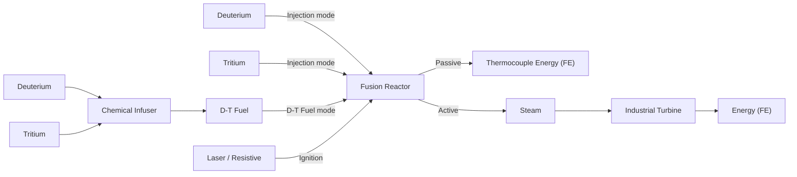
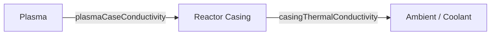
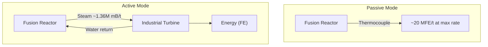

# Fusion Reactor Planner

## Overview

The Fusion Reactor is a fixed-size multiblock structure in Mekanism that combines Deuterium and Tritium (D-T fuel) to produce massive amounts of energy. Unlike the Fission Reactor, the Fusion Reactor has no variable sizing — it is always the same shape and dimensions.

## Construction

The Fusion Reactor is a **fixed-size** multiblock. There are no variable dimensions to choose — you build the one prescribed structure. The frame is constructed from Fusion Reactor Frames, with Fusion Reactor Ports for I/O and a Fusion Reactor Controller as the central interface block. Reactor Glass can fill any non-edge face position.

> **Danger:** An active fusion reactor deals **50,000 magic damage per second** to any entity inside the reactor structure. Do not enter a running reactor.

### Ignition Methods

The reactor must reach a plasma temperature of **100 MK (1 × 10⁸ K)** before the fusion reaction can self-sustain. Two ignition methods are available:

#### Laser Ignition (recommended)

Fire a laser carrying **≥ 1 GFE** of energy at the reactor's **Laser Focus Matrix** block. The Hohlraum must be charged and inserted into the Laser Focus Matrix before firing. A single sufficiently-powered pulse is enough to ignite the plasma.

#### Resistive Heating

The reactor can also be ignited by resistive heating, which requires delivering approximately **18 GFE** of total electrical energy to the reactor. This is significantly more energy than laser ignition and is generally not preferred.

## Fuel System

D-T fuel is produced by combining **Deuterium** and **Tritium** in a Chemical Infuser:

$$\text{Deuterium} + \text{Tritium} \longrightarrow \text{D-T Fuel}$$

### Injection Rate

The injection rate can be set from **0 to 98 mB/t** and must be an **even number**. Each tick the reactor consumes equal parts of each reactant:

$$\text{Deuterium consumed} = \frac{\text{injectionRate}}{2} \;\text{mB/t}$$

$$\text{Tritium consumed} = \frac{\text{injectionRate}}{2} \;\text{mB/t}$$

| Injection Rate (mB/t) | Deuterium (mB/t) | Tritium (mB/t) |
| ---------------------- | ----------------- | --------------- |
| 2                      | 1                 | 1               |
| 10                     | 5                 | 5               |
| 50                     | 25                | 25              |
| 98                     | 49                | 49              |

### D-T Fuel Mode (Pre-mixed)

As an alternative to feeding Deuterium and Tritium separately via the injection rate, you can supply **pre-mixed D-T Fuel** directly to the reactor. This is a distinct operating mode:

- Each tick, the reactor consumes the **entire contents** of its D-T Fuel tank (up to **1,000 mB** per tick).
- At full tank consumption, this mode produces approximately **200 MFE/t** — roughly 10× the output of the injection-rate mode at max rate.
- D-T Fuel is produced by combining Deuterium and Tritium in a **Chemical Infuser** (see the flowchart above).
- Because the entire tank is drained each tick, you need a large, fast supply of D-T Fuel to sustain this mode continuously.

> **When to use D-T Fuel mode:** Use this mode when you need maximum energy output and can supply pre-mixed fuel fast enough to keep up. The injection-rate mode (separate D and T) is easier to sustain at moderate rates.

### Tank Capacities

Tank capacities scale with injection rate:

$$\text{Water capacity} = \text{injectionRate} \times 1{,}000{,}000 \;\text{mB}$$

$$\text{Steam capacity} = \text{injectionRate} \times 100{,}000{,}000 \;\text{mB}$$

$$\text{Fuel capacity} = 500 \;\text{mB (fixed)}$$

## Energy Output

### Fuel Burned Per Tick

Each tick, the amount of fuel actually burned depends on the plasma temperature, a burn ratio, and the stored fuel:

$$\text{fuelBurned} = \text{clamp}\!\Big((\,T_{\text{plasma}} - 1 \times 10^8\,) \times \text{burnRatio},\; 0,\; \text{stored}\Big)$$

where:
- $T_{\text{plasma}}$ is the current plasma temperature (K)
- $\text{burnRatio}$ is derived from injection rate: $\text{burnRatio} = \tfrac{\text{injectionRate}}{2}$
- $\text{stored}$ is the current D-T fuel in the tank

The burn only occurs when $T_{\text{plasma}} > 1 \times 10^8$ K (100 million K, the burn temperature).

### Energy Added to Plasma

The energy released by burning fuel heats the plasma:

$$\Delta T_{\text{plasma}} = \frac{\text{fuelBurned} \times E_{\text{fuel}}}{C_{\text{plasma}}}$$

where:
- $E_{\text{fuel}} = 10{,}000{,}000 \;\text{J/mB}$ (`ENERGY_PER_FUEL`)
- $C_{\text{plasma}} = 100$ (plasma heat capacity)

## Heat Transfer

Heat flows from the plasma to the reactor casing, and from the casing to the environment.

### Plasma to Casing

$$Q_{\text{plasma→case}} = k_{\text{pc}} \times (T_{\text{plasma}} - T_{\text{case}})$$

where $k_{\text{pc}} = 0.2$ (plasma-case conductivity).

The plasma temperature decreases and the casing temperature increases by the transferred heat (scaled by their respective heat capacities).

### Casing to Ambient (Air)

$$Q_{\text{case→air}} = k_{\text{ct}} \times (T_{\text{case}} - T_{\text{ambient}})$$

where:
- $k_{\text{ct}} = 0.333\overline{3}$ (`CASING_THERMAL_CONDUCTIVITY`)
- $T_{\text{ambient}} = 300 \;\text{K}$

## Passive Cooling (Thermocouple)

In passive mode, the reactor converts casing heat directly into energy via an internal thermocouple:

$$P_{\text{passive}} = \eta_{\text{tc}} \times k_{\text{ct}} \times (T_{\text{case}} - T_{\text{ambient}})$$

where:
- $\eta_{\text{tc}} = 0.04$ (`THERMOCOUPLE_EFFICIENCY`)
- $k_{\text{ct}} = 0.333\overline{3}$ (`CASING_THERMAL_CONDUCTIVITY`)
- $T_{\text{ambient}} = 300 \;\text{K}$

Substituting constants:

$$P_{\text{passive}} = 0.04 \times 0.333\overline{3} \times (T_{\text{case}} - 300) \approx 0.01333 \times (T_{\text{case}} - 300) \;\text{J/t}$$

> Note: Passive cooling is simpler but far less efficient than active cooling. It is primarily useful for low injection rates or as a supplemental output.

## Active Cooling (Steam)

In active mode, the reactor uses water to absorb casing heat and produce steam, which is then sent to an Industrial Turbine.

### Steam Production

$$\text{steam (mB/t)} = r_{\text{water}} \times (T_{\text{case}} - T_{\text{ambient}})$$

where $r_{\text{water}} = 0.27272727\overline{27}$ (`WATER_HEATING_RATIO`).

This value is limited by:
1. The available water supply per tick
2. The remaining steam tank capacity

$$\text{steam}_{\text{actual}} = \min\!\big(\text{steam}_{\text{formula}},\; \text{waterAvailable},\; \text{steamTankRemaining}\big)$$

### Energy from Steam

The steam is routed to an Industrial Turbine. Energy output depends on the turbine's blade count and steam throughput.

## Ignition Temperature

The reactor requires a plasma temperature above **1 × 10⁸ K (100 MK)** before the fusion burn occurs. This is a fixed threshold — the burn formula only produces heat when $T_{\text{plasma}} > 1 \times 10^8$ K.

Once burning begins, the plasma temperature stabilises at a steady state determined by the balance of energy input from fusion and heat loss to the casing. Higher injection rates produce more heat per tick, driving the plasma to a higher equilibrium temperature, but the ignition threshold itself is always 100 MK regardless of injection rate.

## Worked Example

**Configuration:** Injection rate = 98 mB/t

### Fuel Consumption

$$\text{Deuterium} = \frac{98}{2} = 49 \;\text{mB/t} = 980 \;\text{mB/s}$$

$$\text{Tritium} = \frac{98}{2} = 49 \;\text{mB/t} = 980 \;\text{mB/s}$$

### Tank Capacities

$$\text{Water capacity} = 98 \times 1{,}000{,}000 = 98{,}000{,}000 \;\text{mB}$$

$$\text{Steam capacity} = 98 \times 100{,}000{,}000 = 9{,}800{,}000{,}000 \;\text{mB}$$

### Passive Mode (Thermocouple)

At maximum injection rate (98 mB/t), the reactor in passive mode produces approximately **20 MFE/t** (≈ 50 MJ/t) at steady state.

To verify: the formula $P_{\text{passive}} = 0.01333 \times (T_{\text{case}} - 300)$ J/t requires a steady-state case temperature of roughly **3.75 GK** to reach 50 MJ/t. This illustrates that the casing runs extremely hot at max injection rate.

As a lower-injection-rate illustration, assume $T_{\text{case}} = 5{,}000{,}000 \;\text{K}$:

$$P_{\text{passive}} = 0.04 \times 0.333\overline{3} \times (5{,}000{,}000 - 300) \approx 66{,}662 \;\text{J/t} \approx 1{,}333{,}240 \;\text{J/s}$$

This illustrative case temp is well below equilibrium for injection 98 — in practice, passive output at full rate is far higher.

### Active Mode (Steam)

At the same case temperature:

$$\text{steam} = 0.27272727 \times (5{,}000{,}000 - 300) \approx 1{,}363{,}553 \;\text{mB/t}$$

This steam is then processed by an Industrial Turbine for significantly higher energy output than passive mode.

> Note: Active cooling produces orders of magnitude more usable energy than passive cooling and is strongly recommended for injection rate 98.
