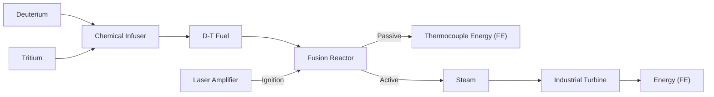
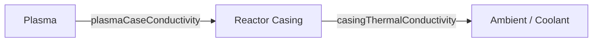
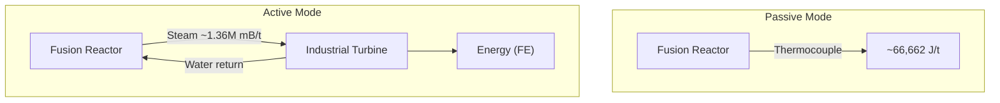

# Fusion Reactor Planner

## Overview

The Fusion Reactor is a fixed-size multiblock structure in Mekanism that combines Deuterium and Tritium (D-T fuel) to produce massive amounts of energy. Unlike the Fission Reactor, the Fusion Reactor has no variable sizing — it is always the same shape and dimensions.

## Construction

The Fusion Reactor is a **fixed-size** multiblock. There are no variable dimensions to choose — you build the one prescribed structure. The frame is constructed from Fusion Reactor Frames, with Fusion Reactor Ports for I/O and a Fusion Reactor Controller as the central interface block. Reactor Glass can fill any non-edge face position.

### Laser Ignition

The reactor requires a **Laser Amplifier** to reach ignition temperature before the fusion process begins. A laser beam must be directed at the reactor's Laser Focus Matrix block. The energy delivered by the laser heats the plasma until it crosses the ignition threshold.

## Fuel System

D-T fuel is produced by combining **Deuterium** and **Tritium** in a Chemical Infuser:

$$\text{Deuterium} + \text{Tritium} \longrightarrow \text{D-T Fuel}$$

### Injection Rate

The injection rate can be set from **0 to 98 mB/t** and must be an **even number**. Each tick the reactor consumes equal parts of each reactant:

$$\text{Deuterium consumed} = \frac{\text{injectionRate}}{2} \;\text{mB/t}$$

$$\text{Tritium consumed} = \frac{\text{injectionRate}}{2} \;\text{mB/t}$$

| Injection Rate (mB/t) | Deuterium (mB/t) | Tritium (mB/t) |
| ---------------------- | ----------------- | --------------- |
| 2                      | 1                 | 1               |
| 10                     | 5                 | 5               |
| 50                     | 25                | 25              |
| 98                     | 49                | 49              |

### Tank Capacities

Tank capacities scale with injection rate:

$$\text{Water capacity} = \text{injectionRate} \times 1{,}000{,}000 \;\text{mB}$$

$$\text{Steam capacity} = \text{injectionRate} \times 100{,}000{,}000 \;\text{mB}$$

$$\text{Fuel capacity} = 500 \;\text{mB (fixed)}$$

## Energy Output

### Fuel Burned Per Tick

Each tick, the amount of fuel actually burned depends on the plasma temperature, a burn ratio, and the stored fuel:

$$\text{fuelBurned} = \text{clamp}\!\Big((\,T_{\text{plasma}} - 1 \times 10^8\,) \times \text{burnRatio},\; 0,\; \text{stored}\Big)$$

where:
- $T_{\text{plasma}}$ is the current plasma temperature (K)
- $\text{burnRatio}$ is derived from injection rate: $\text{burnRatio} = \tfrac{\text{injectionRate}}{2}$
- $\text{stored}$ is the current D-T fuel in the tank

The burn only occurs when $T_{\text{plasma}} > 1 \times 10^8$ K (100 million K, the burn temperature).

### Energy Added to Plasma

The energy released by burning fuel heats the plasma:

$$\Delta T_{\text{plasma}} = \frac{\text{fuelBurned} \times E_{\text{fuel}}}{C_{\text{plasma}}}$$

where:
- $E_{\text{fuel}} = 10{,}000{,}000 \;\text{J/mB}$ (`ENERGY_PER_FUEL`)
- $C_{\text{plasma}} = 100$ (plasma heat capacity)

## Heat Transfer

Heat flows from the plasma to the reactor casing, and from the casing to the environment.

### Plasma to Casing

$$Q_{\text{plasma→case}} = k_{\text{pc}} \times (T_{\text{plasma}} - T_{\text{case}})$$

where $k_{\text{pc}} = 0.2$ (plasma-case conductivity).

The plasma temperature decreases and the casing temperature increases by the transferred heat (scaled by their respective heat capacities).

### Casing to Ambient (Air)

$$Q_{\text{case→air}} = k_{\text{ct}} \times (T_{\text{case}} - T_{\text{ambient}})$$

where:
- $k_{\text{ct}} = 0.333\overline{3}$ (`CASING_THERMAL_CONDUCTIVITY`)
- $T_{\text{ambient}} = 300 \;\text{K}$

## Passive Cooling (Thermocouple)

In passive mode, the reactor converts casing heat directly into energy via an internal thermocouple:

$$P_{\text{passive}} = \eta_{\text{tc}} \times k_{\text{ct}} \times (T_{\text{case}} - T_{\text{ambient}})$$

where:
- $\eta_{\text{tc}} = 0.04$ (`THERMOCOUPLE_EFFICIENCY`)
- $k_{\text{ct}} = 0.333\overline{3}$ (`CASING_THERMAL_CONDUCTIVITY`)
- $T_{\text{ambient}} = 300 \;\text{K}$

Substituting constants:

$$P_{\text{passive}} = 0.04 \times 0.333\overline{3} \times (T_{\text{case}} - 300) \approx 0.01333 \times (T_{\text{case}} - 300) \;\text{J/t}$$

> Note: Passive cooling is simpler but far less efficient than active cooling. It is primarily useful for low injection rates or as a supplemental output.

## Active Cooling (Steam)

In active mode, the reactor uses water to absorb casing heat and produce steam, which is then sent to an Industrial Turbine.

### Steam Production

$$\text{steam (mB/t)} = r_{\text{water}} \times (T_{\text{case}} - T_{\text{ambient}})$$

where $r_{\text{water}} = 0.27272727\overline{27}$ (`WATER_HEATING_RATIO`).

This value is limited by:
1. The available water supply per tick
2. The remaining steam tank capacity

$$\text{steam}_{\text{actual}} = \min\!\big(\text{steam}_{\text{formula}},\; \text{waterAvailable},\; \text{steamTankRemaining}\big)$$

### Energy from Steam

The steam is routed to an Industrial Turbine. Energy output depends on the turbine's blade count and steam throughput.

## Ignition Temperature

The reactor requires a minimum plasma temperature before the fusion reaction sustains itself. The ignition temperature is derived from the injection rate:

$$T_{\text{ignition}} = 1 \times 10^8 \times \frac{1}{\text{burnRatio}}$$

where $\text{burnRatio} = \tfrac{\text{injectionRate}}{2}$.

For injection rate 2 (burnRatio = 1):

$$T_{\text{ignition}} = 1 \times 10^8 \;\text{K}$$

For injection rate 98 (burnRatio = 49):

$$T_{\text{ignition}} = \frac{1 \times 10^8}{49} \approx 2{,}040{,}816 \;\text{K}$$

> Note: Higher injection rates require less laser energy to reach ignition because the burn ratio is higher, meaning the threshold effective temperature is lower relative to the burn temperature.

## Worked Example

**Configuration:** Injection rate = 98 mB/t

### Fuel Consumption

$$\text{Deuterium} = \frac{98}{2} = 49 \;\text{mB/t} = 980 \;\text{mB/s}$$

$$\text{Tritium} = \frac{98}{2} = 49 \;\text{mB/t} = 980 \;\text{mB/s}$$

### Tank Capacities

$$\text{Water capacity} = 98 \times 1{,}000{,}000 = 98{,}000{,}000 \;\text{mB}$$

$$\text{Steam capacity} = 98 \times 100{,}000{,}000 = 9{,}800{,}000{,}000 \;\text{mB}$$

### Passive Mode (Thermocouple)

Assume steady-state case temperature of $T_{\text{case}} = 5{,}000{,}000 \;\text{K}$:

$$P_{\text{passive}} = 0.04 \times 0.333\overline{3} \times (5{,}000{,}000 - 300) \approx 66{,}662 \;\text{J/t} \approx 1{,}333{,}240 \;\text{J/s}$$

### Active Mode (Steam)

At the same case temperature:

$$\text{steam} = 0.27272727 \times (5{,}000{,}000 - 300) \approx 1{,}363{,}553 \;\text{mB/t}$$

This steam is then processed by an Industrial Turbine for significantly higher energy output than passive mode.

> Note: Active cooling produces orders of magnitude more usable energy than passive cooling and is strongly recommended for injection rate 98.
