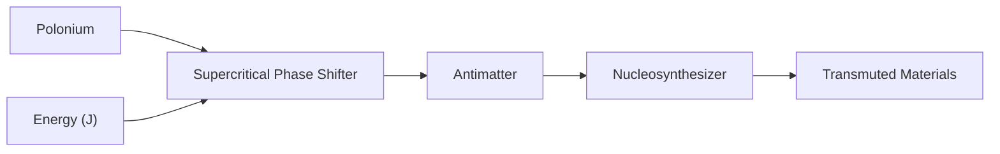
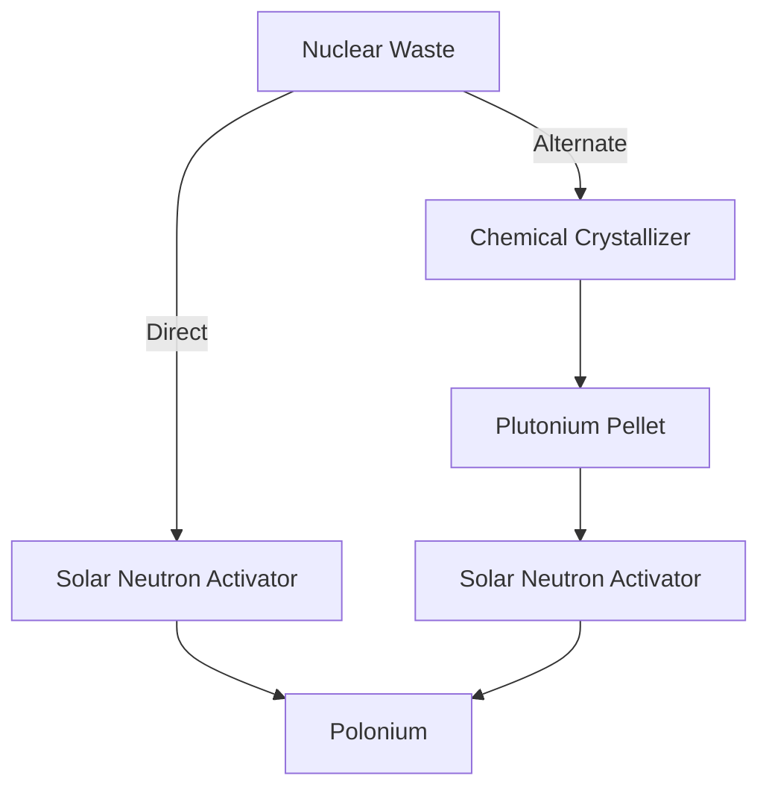

# Supercritical Phase Shifter (SPS)

## Overview

The Supercritical Phase Shifter (SPS) converts **Polonium** into **Antimatter** using massive amounts of energy. Antimatter is the key ingredient for the **Nucleosynthesizer**, which enables transmutation of materials.

## Construction

The SPS is a **fixed-size** multiblock structure of $7 \times 7 \times 7$ (including corners).

| Component | Count | Role |
| --- | --- | --- |
| SPS Casing | 72 | Structural frame and faces |
| Reactor/Structural Glass | 123 | Transparent face panels |
| SPS Port | 3 | Input (Polonium, Energy) / Output (Antimatter) |
| Supercharged Coil | 1 | Interior energy delivery (required for operation) |

* Edges and faces follow the same rules as other Mekanism multiblocks — casings on edges, ports and casings on faces.
* **Supercharged Coils** must be placed inside the structure and are required to supply energy to the phase-shifting process.
* At least one port must be configured for Polonium input, one for energy input, and one for Antimatter output.
* **SPS Casings are expensive to craft** — each one requires $50{,}000\;\text{mB}$ of processed Nuclear Waste, making the full structure a significant investment.

## Processing

### Input / Output

| | Chemical | Capacity |
| --- | --- | --- |
| Input | Polonium | $\text{POL\_PER\_AM} \times 2 = 1{,}000 \times 2 = 2{,}000\;\text{mB}$ |
| Output | Antimatter | $\text{OUTPUT\_CAPACITY} = 1{,}000\;\text{mB}$ |

### Conversion Ratio

$$1{,}000\;\text{mB Polonium} \longrightarrow 1\;\text{mB Antimatter}$$

This is governed by the constant $\text{POL\_PER\_AM} = 1{,}000$.

### Processing Rate

The rate at which Polonium is consumed each tick depends on the energy delivered to the SPS:

$$R_{\text{pol}} = \frac{E_{\text{received}}}{\text{ENERGY\_PER\_INPUT}} \;\;\text{mB/t}$$

where $\text{ENERGY\_PER\_INPUT} = 100{,}000\;\text{J}$ per mB of Polonium processed.

The resulting Antimatter production rate is

$$R_{\text{am}} = \frac{R_{\text{pol}}}{\text{POL\_PER\_AM}} = \frac{R_{\text{pol}}}{1{,}000} \;\;\text{mB/t}$$

### Hardware Caps

The SPS has two hard limits imposed by its physical structure, regardless of how much energy is supplied:

| Limit | Value | Source |
| --- | --- | --- |
| Maximum Antimatter production | **2 mB/t** | Hardware cap — cannot be exceeded |
| Maximum useful energy input | **800 MFE/t** | 2 SPS Ports × 400 MFE/t each |

> Energy delivered beyond **800 MFE/t** is accepted but wasted — the SPS will not convert it into additional Antimatter output. The 2 mB/t antimatter cap is a hard ceiling regardless of energy input.

The effective rate formula accounting for the cap is:

$$R_{\text{am}} = \min\!\left(\frac{E_{\text{received}}}{1{,}000 \times 100{,}000},\; 2\right) \;\;\text{mB/t}$$

## Tank Capacities

| Tank | Formula | Value |
| --- | --- | --- |
| Input (Polonium) | $\text{POL\_PER\_AM} \times 2$ | $2{,}000\;\text{mB}$ |
| Output (Antimatter) | $\text{OUTPUT\_CAPACITY}$ | $1{,}000\;\text{mB}$ |

## Polonium Sourcing Chain

Polonium is obtained from **Nuclear Waste** produced by the Fission Reactor. There are two paths:

| Path | Steps |
| --- | --- |
| Direct | Nuclear Waste --> Solar Neutron Activator --> Polonium |
| Alternate | Nuclear Waste --> Chemical Crystallizer --> Plutonium Pellet --> Solar Neutron Activator --> Polonium |

> Note: The direct path is simpler but the alternate path through Plutonium Pellets can be useful when balancing waste processing across multiple machines.

## Energy Requirements

For a target Antimatter production rate $R_{\text{am}}$ (mB/t), the total energy required per tick is

$$E_{\text{total}} = R_{\text{am}} \times \text{POL\_PER\_AM} \times \text{ENERGY\_PER\_INPUT}$$

$$E_{\text{total}} = R_{\text{am}} \times 1{,}000 \times 100{,}000 = R_{\text{am}} \times 10^{8}\;\text{J/t}$$

| Target $R_{\text{am}}$ (mB/t) | Polonium Demand (mB/t) | Energy Demand (J/t) | Notes |
| --- | --- | --- | --- |
| 0.001 | 1 | 100,000 | |
| 0.01 | 10 | 1,000,000 | |
| 0.1 | 100 | 10,000,000 | |
| 1.0 | 1,000 | 100,000,000 | |
| **2.0** | **2,000** | **200,000,000** | **Hardware cap — maximum achievable** |

> Values above 2 mB/t are impossible regardless of energy input. Do not over-invest in energy infrastructure expecting output beyond the 2 mB/t ceiling.

## Worked Example

**Goal:** Run the SPS at maximum output — $2\;\text{mB/t}$ of Antimatter (hardware cap).

1. **Polonium demand:**

$$R_{\text{pol}} = R_{\text{am}} \times \text{POL\_PER\_AM} = 2 \times 1{,}000 = 2{,}000\;\text{mB/t}$$

2. **Energy demand:**

$$E = R_{\text{pol}} \times \text{ENERGY\_PER\_INPUT} = 2{,}000 \times 100{,}000 = 200{,}000{,}000\;\text{J/t} = 200\;\text{MJ/t}$$

3. **Port bandwidth check:**

The SPS structure includes 3 ports. With 2 ports dedicated to energy input (each accepting up to 400 MFE/t), the maximum energy delivery is $800\;\text{MFE/t}$, which is well above the $200\;\text{MJ/t}$ needed. Supply at least $200\;\text{MJ/t}$; any excess beyond that is wasted.

4. **Summary:**

| Parameter | Value |
| --- | --- |
| Antimatter rate | $2\;\text{mB/t}$ (hardware cap) |
| Polonium consumption | $2{,}000\;\text{mB/t}$ |
| Minimum energy input | $200\;\text{MJ/t}$ |
| Maximum useful energy input | $800\;\text{MFE/t}$ |

> At 20 ticks/second this equals $4\;\text{GJ/s}$ of sustained energy input and $40\;\text{mB/s}$ of Antimatter output. Producing more than this from a single SPS is not possible — build additional SPS structures instead.

### Lower-Output Reference

**Goal:** Produce $1\;\text{mB/t}$ of Antimatter.

1. **Polonium demand:** $1 \times 1{,}000 = 1{,}000\;\text{mB/t}$
2. **Energy demand:** $1{,}000 \times 100{,}000 = 100{,}000{,}000\;\text{J/t} = 100\;\text{MJ/t}$

| Parameter | Value |
| --- | --- |
| Antimatter rate | $1\;\text{mB/t}$ |
| Polonium consumption | $1{,}000\;\text{mB/t}$ |
| Energy input | $100\;\text{MJ/t}$ |

> At 20 ticks/second this equals $2\;\text{GJ/s}$ of sustained energy input and $20\;\text{mB/s}$ of Antimatter output.
