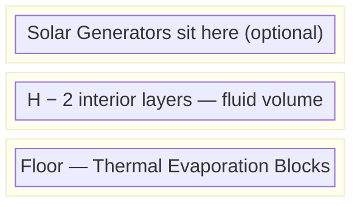
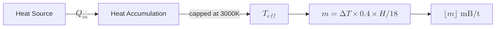
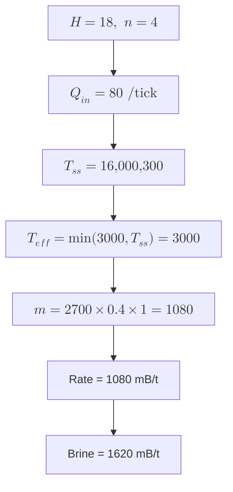

# Thermal Evaporation Plant

## Overview

The Thermal Evaporation Plant is a Mekanism multiblock tower that uses heat to evaporate fluids. It is the primary method for producing Brine from Water and Lithium from Brine, both essential resources in the Mekanism production chain.

The structure has an **open top** (no roof) and accepts fluid input through Thermal Evaporation Valves. A single Thermal Evaporation Controller is required and acts as the brain of the multiblock.

## Construction

- **Footprint**: Fixed at $4 \times 4$ blocks (outer dimensions).
- **Height**: Variable from $H_{\min} = 3$ to $H_{\max} = 18$ blocks tall (exterior).
- **Top**: Open — no roof casing. Solar Generators can be placed on the top ring.
- **Walls**: Thermal Evaporation Blocks form the edges and faces of the rectangular prism shell.
- **Controller**: Exactly 1 Thermal Evaporation Controller must be placed on the structure (replaces one wall block).
- **Valves**: Thermal Evaporation Valves replace wall blocks for fluid I/O (input and output).

## Heat Sources

The plant requires an external heat source to operate. Options include:

- **Advanced Solar Generators** — up to 4 placed on the top ring of the structure. Free energy but only work during daytime.
- **Resistive Heater** — powered by electricity, provides consistent heat day and night. Connected via Thermodynamic Conductor.
- **Fission Reactor excess heat** — can pipe waste heat from a fission reactor.
- Any heat source connected via Thermodynamic Conductors.

The interior volume of the structure is

$$V = (4 - 2)^2 \times (H - 2) = 4(H - 2).$$

## Constants (Default Mekanism 1.20)

These symbols reference `src/app/models/constants.ts` under `EVAP_PLANT`:

| Symbol | Constant | Value |
|--------|----------|-------|
| $d$ | `HEAT_DISSIPATION` | $0.02$ |
| $\sigma$ | `SOLAR_MULTIPLIER` | $0.2$ |
| $\mu$ | `TEMP_MULTIPLIER` | $0.4$ |
| $c$ | `HEAT_CAPACITY` | $100.0$ |
| $\tau$ | `FLUID_PER_TANK` | $64{,}000$ |
| $\tau_o$ | `OUTPUT_TANK_CAPACITY` | $10{,}000$ |

The ambient (baseline) temperature is $T_{\text{amb}} = 300$ (Kelvin-like units used by Mekanism internally).

## Heat System

### Solar Heat Input

Each Advanced Solar Generator on top of the structure contributes heat every tick. With $n$ active solar panels:

$$Q_{\text{in}} = n \times \sigma \times c = n \times 0.2 \times 100 = 20n \quad \text{per tick.}$$

Solar panels only produce heat during daytime and clear weather. At night or during rain, $Q_{\text{in}} = 0$.

### Heat Dissipation

The structure loses heat to the environment each tick based on the temperature difference from ambient:

$$Q_{\text{out}}(T) = d \times \sqrt{|T - T_{\text{amb}}|} = 0.02 \times \sqrt{|T - 300|}.$$

The square-root relationship means dissipation increases sub-linearly with temperature — higher temperatures are increasingly efficient at retaining heat.

### Steady-State Temperature

At equilibrium, heat input equals heat dissipation:

$$Q_{\text{in}} = Q_{\text{out}}(T_{\text{ss}})$$

$$20n = 0.02 \sqrt{T_{\text{ss}} - 300}$$

Solving for $T_{\text{ss}}$:

$$\sqrt{T_{\text{ss}} - 300} = \frac{20n}{0.02} = 1000n$$

$$T_{\text{ss}} = 300 + (1000n)^2 = 300 + 1{,}000{,}000 \, n^2.$$

For common configurations:

| Solar Panels ($n$) | $T_{\text{ss}}$ |
|---------------------|-----------------|
| 0 | 300 (ambient) |
| 1 | 1,000,300 |
| 2 | 4,000,300 |
| 3 | 9,000,300 |
| 4 | 16,000,300 |

Note that $T_{\text{ss}}$ grows quadratically with the number of solar panels, but the production rate caps the effective temperature at $3{,}000$ (see below).

## Production Rate

### Temperature Multiplier

The production speed depends on a temperature multiplier that also scales linearly with the structure's height fraction:

$$m = \left(\min(3000,\; T) - T_{\text{amb}}\right) \times \mu \times \frac{H}{H_{\max}}$$

$$m = \left(\min(3000,\; T) - 300\right) \times 0.4 \times \frac{H}{18}.$$

Because $T_{\text{ss}} \gg 3000$ for any $n \ge 1$, the effective temperature is clamped at $3{,}000$ whenever at least one solar panel is active:

$$m_{\text{capped}} = (3000 - 300) \times 0.4 \times \frac{H}{18} = 2700 \times 0.4 \times \frac{H}{18} = 1080 \times \frac{H}{18} = 60H.$$

### Output Behaviour

The multiplier $m$ determines fluid output in one of two modes:

- **If $m \ge 1$**: the plant produces $\lfloor m \rfloor$ mB of output per tick.
- **If $0 < m < 1$**: the plant produces 1 mB of output every $\lceil 1/m \rceil$ ticks.

With at least one solar panel and any valid height ($H \ge 3$), we have $m \ge 60 \times 3 = 180$, so the plant always operates in the first mode when solar-heated.

### Production Formula (Solar Active)

$$\text{rate} = \left\lfloor 60 \times H \right\rfloor \quad \text{mB/t}.$$

## Tank Capacity

The input tank capacity is determined by the structure's total volume divided by 4, multiplied by the per-tank constant:

$$C_{\text{input}} = \frac{V_{\text{total}}}{4} \times \tau = \frac{4 \times 4 \times H}{4} \times 64{,}000 = 4H \times 64{,}000 = 256{,}000 \, H \quad \text{mB}.$$

The output tank has a fixed capacity:

$$C_{\text{output}} = \tau_o = 10{,}000 \quad \text{mB}.$$

## Recipes

### Water → Brine

The Thermal Evaporation Plant consumes Water and produces Brine at a 10:15 ratio:

$$10 \text{ mB Water} \longrightarrow 15 \text{ mB Brine}.$$

The effective Brine output rate is therefore $1.5\times$ the plant's base production rate.

### Brine → Lithium

Brine can be further evaporated into Lithium:

$$10 \text{ mB Brine} \longrightarrow 1 \text{ mB Lithium}.$$

This is a much lower yield and typically requires dedicated plants or longer run times.

## Optimal Height Analysis

Since the production rate scales linearly with $H$:

$$\text{rate}(H) = \lfloor 60 H \rfloor \quad \text{mB/t (with solar)},$$

the relationship is strictly linear — there are **no diminishing returns** per block of height when solar panels are active. Each additional block of height adds a constant $60$ mB/t to the output.

However, the **cost per block of height** is constant (each ring requires 12 Thermal Evaporation Blocks for the 4 × 4 shell), so the build is also linearly more expensive. The practical trade-off is:

| Height $H$ | Rate (mB/t) | Blocks per ring | Total shell blocks |
|-------------|-------------|-----------------|-------------------|
| 3 | 180 | 12 | ~56 |
| 6 | 360 | 12 | ~104 |
| 12 | 720 | 12 | ~200 |
| 18 | 1,080 | 12 | ~296 |

The maximum height of $H = 18$ provides the best absolute throughput. For resource-constrained builds, any height is equally efficient per block invested.

## Worked Example — Height 18, 4 Solar Panels

**Given**: $H = 18$, $n = 4$ solar panels.

### Step 1: Heat Input

$$Q_{\text{in}} = 4 \times 0.2 \times 100 = 80 \quad \text{per tick.}$$

### Step 2: Steady-State Temperature

$$T_{\text{ss}} = 300 + \left(\frac{80}{0.02}\right)^2 = 300 + 4{,}000^2 = 300 + 16{,}000{,}000 = 16{,}000{,}300.$$

This far exceeds the cap of $3{,}000$, so the effective temperature is $T_{\text{eff}} = 3{,}000$.

### Step 3: Temperature Multiplier

$$m = (3000 - 300) \times 0.4 \times \frac{18}{18} = 2700 \times 0.4 \times 1 = 1{,}080.$$

### Step 4: Production Rate

$$\text{rate} = \lfloor 1080 \rfloor = 1{,}080 \quad \text{mB/t}.$$

For Water → Brine (1.5x multiplier):

$$\text{Brine output} = 1{,}080 \times 1.5 = 1{,}620 \quad \text{mB/t}.$$

### Step 5: Tank Capacities

$$C_{\text{input}} = \frac{4 \times 4 \times 18}{4} \times 64{,}000 = 72 \times 64{,}000 = 4{,}608{,}000 \quad \text{mB}.$$

$$C_{\text{output}} = 10{,}000 \quad \text{mB}.$$

### Step 6: Dissipation at Steady State

$$Q_{\text{out}} = 0.02 \times \sqrt{16{,}000{,}300 - 300} = 0.02 \times 4{,}000 = 80.$$

Confirming $Q_{\text{in}} = Q_{\text{out}} = 80$. ✓

### Summary

| Parameter | Value |
|-----------|-------|
| Height | 18 blocks |
| Solar panels | 4 |
| Steady-state temp | 16,000,300 |
| Effective temp | 3,000 (capped) |
| Temp multiplier | 1,080 |
| Base production | 1,080 mB/t |
| Input tank | 4,608,000 mB |
| Output tank | 10,000 mB |

## Practical Notes

- Even a single solar panel pushes the temperature well beyond the 3,000 cap, so adding more panels only affects warm-up time, not steady-state production.
- The output tank (10,000 mB) is relatively small — ensure you pipe products out quickly to avoid backing up the plant.
- For Brine production, the 1.5x recipe multiplier makes the Thermal Evaporation Plant surprisingly productive at max height.
- Multiple plants can be built side-by-side for parallel production of different fluids (e.g., one for Brine, one for Lithium).
